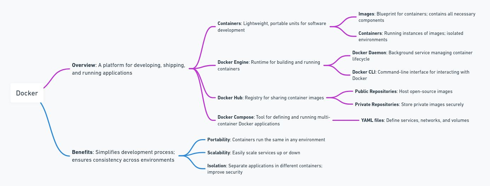
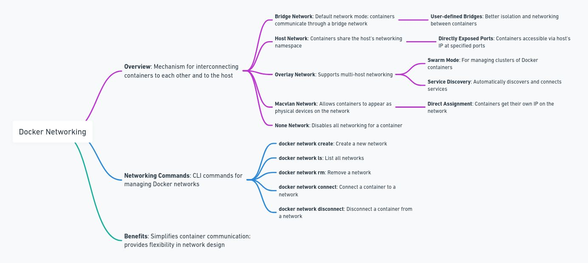

+++
categories = ['Docker']
comments = false
keywords = ['containers']
showActions = false
showMeta = false
tags = ['docker']
title = 'Docker Configuration Overview'
+++

## Overview

## Networking

