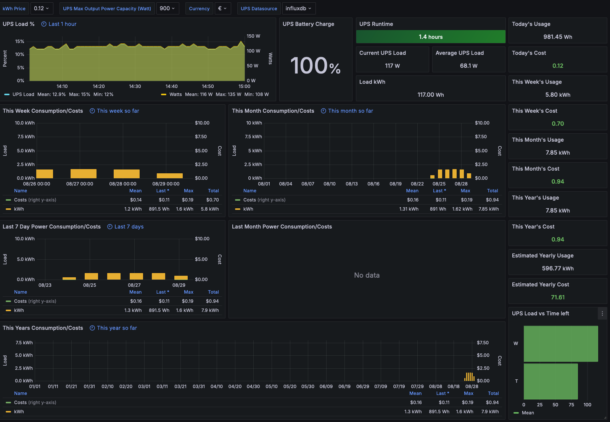

# UPS Monitoring

First off, you have connected the UPS to a free USB port and it shows up using lsusb thus:

```sh
$  lsusb
Bus 001 Device 004: ID 051d:0002 American Power Conversion Uninterruptible Power Supply
```

Install the required APC UPS daemon and PHP packages with:

`apt install apcupsd php -y` 

Once installed stop the apcupsd service if it started automatically with

`systemctl stop apcupsd` 

You'll next need to edit the configuration file for the service which lives at `/etc/apcupsd/apcupsd.conf` . If you'd like enter a **UPSNAME** that makes sense. Then the default version of this file on my system had a line that looked like DEVICE /tty/xxx0, comment out or delete this line and restart the service with:

```sh
systemctl start apcupsd
systemctl status apcupsd
```

If everything looks good in status you should now be able to run:

```sh
$  apcaccess
APC      : 001,036,0866
DATE     : 2024-08-24 18:46:26 +0200
HOSTNAME : pinet
VERSION  : 3.14.14 (31 May 2016) debian
UPSNAME  : APC
...
```

You've completed the UPS / host setup.

## InfluxDB Setup

```sh
curl https://repos.influxdata.com/influxdata-archive.key | gpg --dearmor | sudo tee /usr/share/keyrings/influxdb-archive-keyring.gpg >/dev/null
echo "deb [signed-by=/usr/share/keyrings/influxdb-archive-keyring.gpg] https://repos.influxdata.com/debian stable main" | sudo tee /etc/apt/sources.list.d/influxdb.list
apt update
apt install influxdb
systemctl unmask influxdb
systemctl enable influxdb
systemctl start influxdb
systemctl status influxdb
```

I'll put all the data from your UPS into a separate database.

First, we'll need to create it and can do so using curl:

```sh
curl -i -XPOST  "http://localhost:8086/query?q=CREATE+DATABASE+ups"
```

We can verify successful DB creation again using curl:

```sh
curl -i -XPOST  "http://localhost:8086/query?q=SHOW+DATABASES"
```

```sh
 ~  $  influx
Connected to http://localhost:8086 version 1.8.10
InfluxDB shell version: 1.8.10
> show databases
name: databases
name
----
_internal
ups
> use ups
Using database ups
> show measurements
name: measurements
name
----
APC
> select * from APC where time > now() - 1h
name: APC
time                BATTV BCHARGE LOADPCT TIMELEFT host
----                ----- ------- ------- -------- ----
1724517094829361767               5                myups
1724517094891750548 27                             myups
1724517094952570159                       190.7    myups
1724517095013039249       100                      myups
1724517121518211456               5                myups


```

Note that final entry is ups which is the database we just created. Now we have to move onto scraping the output the UPS generates and write it to the database.

## Scraping the UPS output

Note the section near the top tagsArray and compare the items in the array being scraped against the actual output of apcacess as shown above. Pick and choose the items you want and these are what will be written to the database. The name must match exactly else the scraping will fail.

You will also need to modify, near the bottom, your InfluxDB IP. You needed this above for the curl commands.

```sh
vi /opt/scrape.php
chmod +x /opt/scrape.php
```

```php
#!/usr/bin/php
<?php

$command = "apcaccess";
$args = "status";
$tagsArray = array(
"LOADPCT",
"BATTV",
"TIMELEFT",
"BCHARGE"
);

//do system call

$call = $command." ".$args;
$output = shell_exec($call);

//parse output for tag and value

foreach ($tagsArray as $tag) {

preg_match("/".$tag."\s*:\s([\d|\.]+)/si", $output, $match);

//send measurement, tag and value to influx

sendDB($match[1], $tag);

}
//end system call

//send to influxdb

function sendDB($val, $tagname) {

$curl = "curl -i -XPOST 'http://localhost:8086/write?db=ups' --data-binary 'APC,host=myups ".$tagname."=".$val."'";
$execsr = exec($curl);

}

?>
```

You can do a test run with `/opt/scrape.php` and then verify your InfluxDB logs and look for some successful writes via curl (code 204 = good).

### Automating the scraping

We'll use cron for automating the running of the scraping script. Do not edit the crontab with `crontab -e` instead you must edit `/etc/crontab`  and specify a user in order for this work.

Add the following line to `/etc/crontab`, this will run the scraping script every minute. 

```sh
* * * * * root /usr/bin/php /opt/scrape.php >/dev/null 2>&1
```

Again verify the InfluxDB logs for 204 response codes to check everything went OK.


## Grafana Dashboard

The next step is to add a data source in Grafana. Under the configuration menu in Grafana click "Add data source".
Modify the Name, `Type = InfluxDB, URL = http://influxdb:8086, Database = ups, User = root, Pass = root` . If you modified these values obviously modify to suit.

Then hit save & test.

Next in Grafana click the + icon on the left and select 'import'. We'll be importing this awesome dashboardby Marius Gilberg. The ID you need is 7197.

Select your Influx UPS data source as the new data source we just created above and hit import.

 

