+++
categories = ['Kubernetes']
comments = false
keywords = ['k8s']
showActions = false
showMeta = false
tags = ['k8s']
title = 'K8S Configuration Overview'
+++

Initially, Kubernetes was build to manage Docker Containers. Docker is the technology that made containers accessible to the mainstream. Containers were not an entirely new technology. LXC containers existed before and Linux namespaces are a thing since 2002, but Docker made it so easy to use containers. By handling software packaging, distribution and all low level network and device configuration, Docker allowed every developer to start any application in an isolated environment. Promising to finally overcoming the famous: It works on my machine meme.
Even the Kubernetes core team admits that Kubernetes would've been such a success without Docker.

At some point, a lot of different people and companies tried to solve similar problems regarding containers. They agreed to build some common interfaces for their solutions so that parts of their implementations could be swapped while relying on certain standards. This led to the creation of the Open Container Initiative (OCI), Container Network Interface (CNI), Container Storage Interface (CSI) and Container Runtime Interface (CRI).

## Labels

A consistent labeling strategy helps you filter resources quickly and maintain a clear mental map of your cluster.

- Labels: Key-value pairs used for grouping and selecting Kubernetes objects. For instance, app=my-app, env=staging, team=payments.
- Annotations: Key-value pairs for attaching non-identifying metadata (e.g., version info, contact email, or last-deployed timestamp).

### Safe-to-Evict Annotations

Pods marked with safe-to-evict: false cannot be removed or rescheduled during node scaling or bin-packing operations.

Annotation Example:

```yaml
metadata:
  annotations:
    cluster-autoscaler.kubernetes.io/safe-to-evict: "false"
```

- Naked Pods

Pods created directly without a controller (e.g., Deployments, ReplicaSets) lack the automation needed for rescheduling or scaling.

Naked Pod Example:

```yaml
apiVersion: v1
kind: Pod
metadata:
  name: standalone-pod
spec:
  containers:
  - name: app-container
    image: app-image:v1
```

These pods prevent nodes from being scaled down, leading to idle resources.

- Removing Safe-to-Evict Annotations

Safe-to-evict annotations prevent pods from being evicted by the autoscaler. To find pods with this annotation:

```sh
kubectl get pods --all-namespaces -o json | jq '.items[] | select(.metadata.annotations."cluster-autoscaler.kubernetes.io/safe-to-evict" == "false") | .metadata.name'
```

Once identified, edit the pod configuration to remove the annotation.


## Namespaces 

Why Use Namespaces?

Namespaces help:

- Isolate Resources: Separate applications and environments (e.g., development, staging, production) within the same cluster.
- Manage Access: Apply role-based access control (RBAC) for specific namespaces.
- Organize Resources: Group related resources logically for clarity.

Namespace Like Your Life Depends on It

- Team-based namespaces: Dev, QA, Prod, or per microservice if that makes sense.
- Access Control: Combine namespaces with RBAC (Role-Based Access Control) policies to ensure that only the right people (and services) can mess with your stuff.
-  Resource Quotas: You can set quotas (e.g., CPU, memory) per namespace, preventing one rogue microservice from hogging all resources.

Take a step back and design your namespace strategy; future you will say thanks.

## CRI

With version 1.24, Kubernetes has overcome its dependence on Docker and now only relies on any CRI compliant runtime to start containers.
The containerd project was originally developed by Docker Inc and still is the core of Docker, but its ownership was since donated to the CNCF.
When a new Pod is scheduled to a node, the kubelet communicates with containerd over the container runtime interface to actually pull the image and start the container with the configuration specified in the pod definition. Containerd is now in charge to set up the Linux namespace, mount volumes or devices and apply seccomp profiles and much more for every new container. That's a lot of tasks, and not quite according to the UNIX philosophy to do one thing and do it well.

By default, containerd calls runc. The runc binary actually spawns the container process with all its applied properties. It does not pull images, manages the containers file system, sets up networking or monitors the container process. Overly simplified it is just a spawn syscall with a bunch of extra properties for some isolation, but it still runs on the same kernel since containers are NOT VMs.

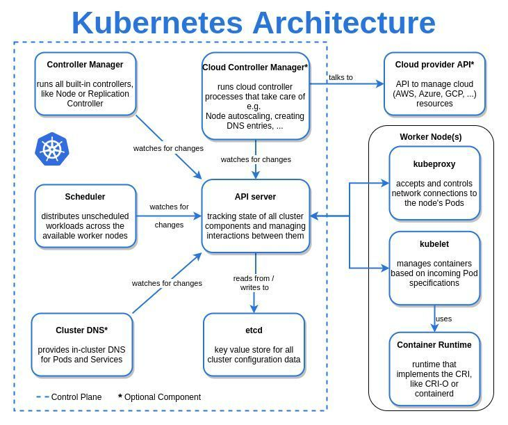

## Master Components

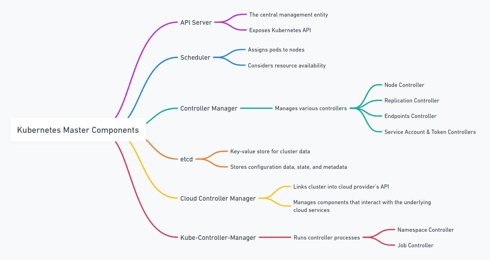

## Configuration

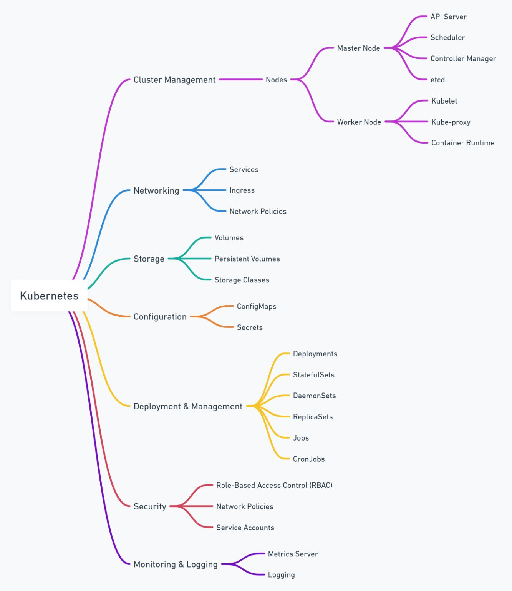

## Networking

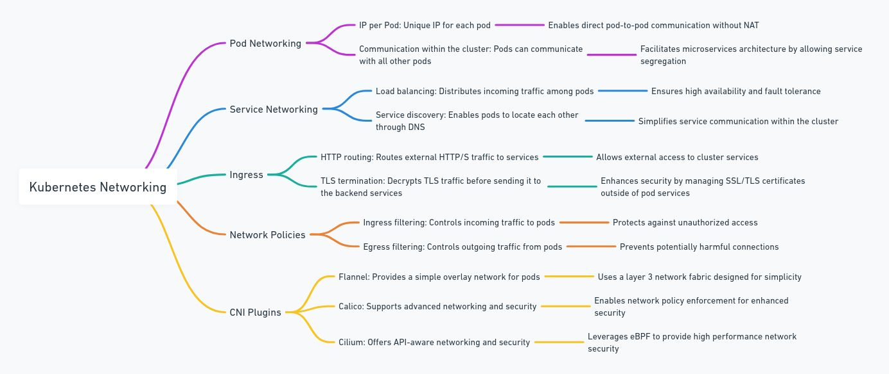

## Resources 

- **Resource Requests**: This is basically your container’s baseline. If your container requests 200m CPU and 512Mi of memory, the Kubernetes scheduler will place your Pod on a node with at least that much capacity available.
- **Resource Limits:**:  This is the upper bound. If your container tries to exceed the limit, it might get throttled (CPU) or even evicted (memory).

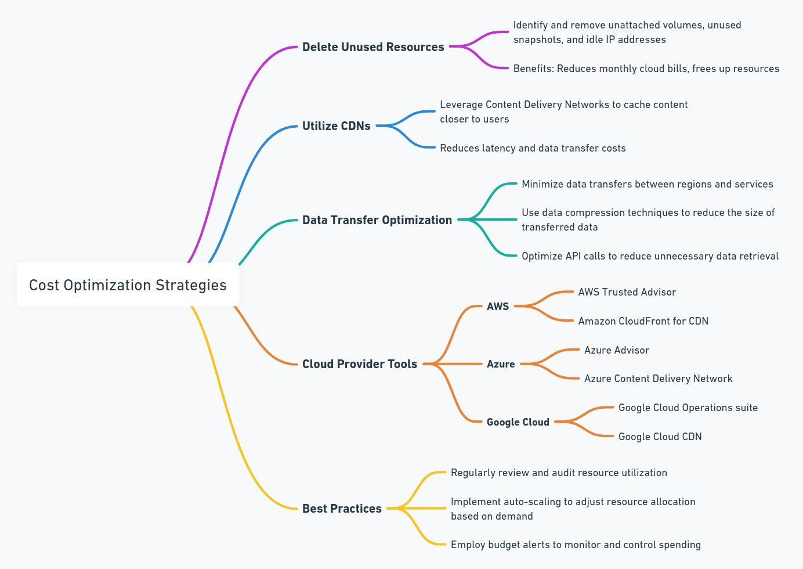

Why do we need Requests & Limits?

- Ensure fair resource sharing between containers.
- Prevent resource hogging by any container.
- Help scheduler make informed decisions about where to place pods.
- Prevent node crashes from overcommitted memory.

Sample YAML:

```yaml
apiVersion: v1
kind: Pod
metadata:
  name: resource-demo
spec:
  containers:
    - name: busybox
      image: busybox
      command: ["sh", "-c", "while true; do echo Hello; sleep 1; done"]
      resources:
        requests:
          memory: "64Mi"
          cpu: "250m"
        limits:
          memory: "128Mi"
          cpu: "500m"
```

Explanation:

- 250m means 250 millicores of CPU (¼ core).
- The container requests 64Mi memory but can't exceed 128Mi.

How Scheduling Works with Requests:

```
Step 1: You apply the pod
Step 2: Scheduler looks for a node with >= requested CPU/memory
Step 3: Pod is scheduled there
Step 4: During runtime, if pod tries to exceed limit:
            - For CPU: throttled
            - For Memory: killed (OOMKilled)
```

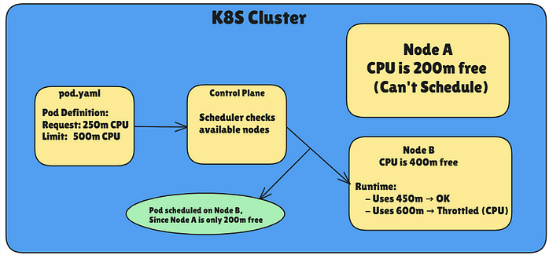

Let's check out QoS (Quality of Service) Classes as well, how Kubernetes uses requests and limits to categorize pods, and how that affects scheduling and eviction.

### Kubernetes QoS Classes

Kubernetes assigns Quality of Service classes to pods based on how you set requests and limits for CPU and memory:

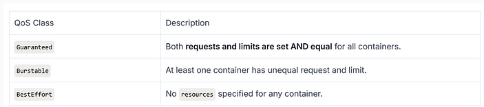

Examples:

1. Guaranteed Pod (QoS Class: Guaranteed)

```yaml
resources:
  requests:
    memory: "128Mi"
    cpu: "500m"
  limits:
    memory: "128Mi"
    cpu: "500m"
```

2. Burstable Pod (QoS Class: Burstable)

```yaml
resources:
  requests:
    memory: "128Mi"
    cpu: "250m"
  limits:
    memory: "256Mi"
    cpu: "500m"
```

3. BestEffort Pod (QoS Class: BestEffort)

```yaml
# No resources section
```

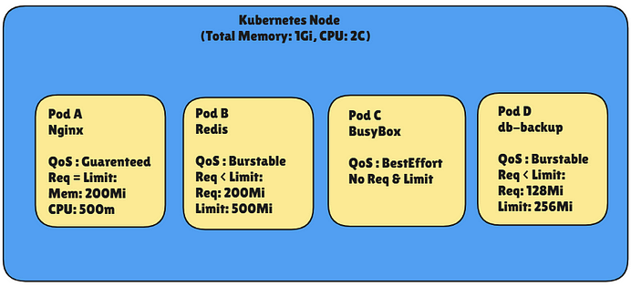

When Node Memory Hits Limit (e.g., High Load)

Eviction Policy Triggered, Kubernetes starts evicting based on QoS priority. 

1️. Pod C (BestEffort) → EVICTED first 
2️. Pod B or D (Burstable) → May be evicted 
3️. Pod A (Guaranteed) → Most protected

Example YAML: Pod with Resource Settings

```yaml
apiVersion: v1
kind: Pod
metadata:
  name: guaranteed-pod
spec:
  containers:
  - name: nginx
    image: nginx
    resources:
      requests:
        memory: "200Mi"
        cpu: "500m"
      limits:
        memory: "200Mi"
        cpu: "500m"
```

This Pod gets Guaranteed QoS class.

Flow:

```yaml
Client applies pod YAML
        │
        ▼
Pod scheduled on node with enough resources
        │
        ▼
Node allocates CPU & Memory based on "requests"
        │
        ▼
If pod exceeds "limits" → It gets throttled or OOMKilled
        │
        ▼
During pressure → Eviction happens in QoS order:
BestEffort → Burstable → Guaranteed
```

Eviction Priority (Important Concept)

When node runs out of memory, Kubernetes evicts pods based on QoS class:

```
BestEffort → Burstable → Guaranteed
 (first)                   (last)
```

So, Guaranteed pods are safest, and BestEffort gets evicted first.

Behavior During Resource Pressure:

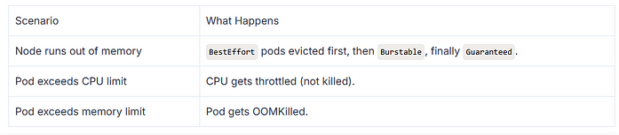

Multi-Container Pod Example

Let's look at a pod with two containers and different QoS setups:

```yaml
apiVersion: v1
kind: Pod
metadata:
  name: multi-demo
spec:
  containers:
  - name: app
    image: nginx
    resources:
      requests:
        memory: "100Mi"
        cpu: "200m"
      limits:
        memory: "100Mi"
        cpu: "200m"
  - name: sidecar
    image: busybox
    command: ["sh", "-c", "while true; do echo sidecar; sleep 2; done"]
    resources:
      requests:
        memory: "64Mi"
        cpu: "100m"
      limits:
        memory: "128Mi"
        cpu: "200m"
```

Resulting QoS for the Pod: Burstable, since sidecar has request ≠ limit

Best Practices

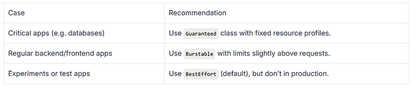

## Taints

```sh
➜  kubectl describe node node1 | grep Taints
Taints:             node-role.kubernetes.io/control-plane:NoSchedule

➜  kubectl taint nodes node1 node-role.kubernetes.io/control-plane:NoSchedule-
node/node1 untainted
```

## Security

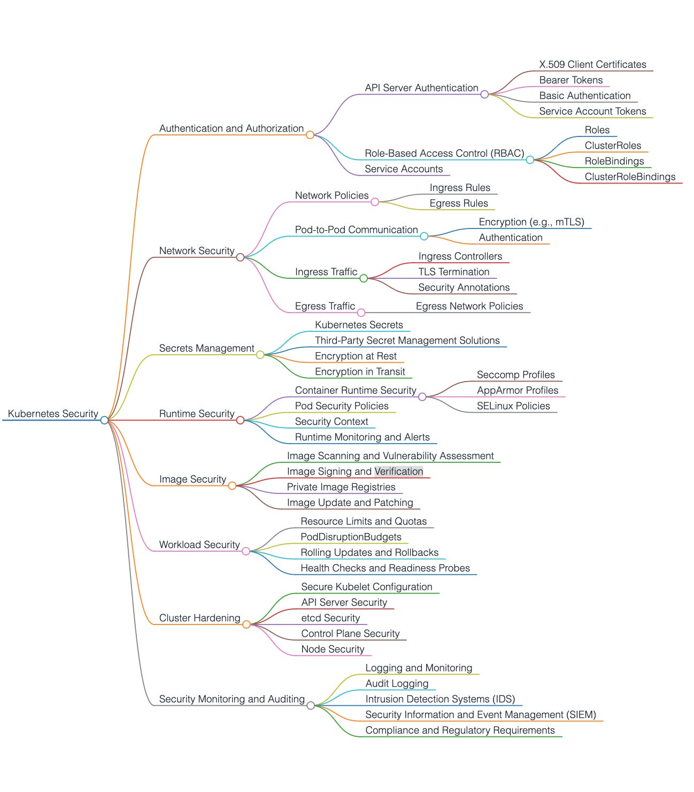

### Secrets

Kubernetes expects the values in stringData to be strings (string)

```yaml
kind: Secret
metadata:
  name: my-secret
type: Opaque
stringData:
  password: "12345"  # ✅ It is now a string
```

If you use data, you must ensure that the values are in Base64:

```yaml
apiVersion: v1
kind: Secret
metadata:
  name: my-secret
type: Opaque
data:
  password: MTIzNDU=  # "12345" in Base64
```

`echo -n "12345" | base64` 

## Probes

Probes are how Kubernetes checks if your containers are alive and ready to serve traffic.

They help Kubernetes:

- Know if a container needs to be restarted (if it's unhealthy).
- Know if a container is ready to receive traffic.

Three Types of Probes

1. Liveness Probe

Checks if the container is alive (i.e., not stuck, unresponsive).

- If the probe fails, Kubernetes restarts the container.
- Useful for apps that might get into a deadlock or stuck state.

2. Readiness Probe

Checks if the container is ready to accept traffic.

- If it fails, traffic is not sent to the container.
- Very useful when your app takes time to initialize or depend on something external.

3. Startup Probe

Used to delay liveness + readiness checks until the app has fully started.

- Prevents false failures when app takes longer to start.
- Once successful, other probes kick in.

Probe Mechanisms (How They Work)
a. Exec Probes

- Runs a command inside the container.
- If exit code = 0, success; else failure.

Example:

```yaml
livenessProbe:
  exec:
    command:
    - cat
    - /tmp/healthy
  initialDelaySeconds: 5
  periodSeconds: 5
```

b. HTTP Probes

- Makes an HTTP GET request to a specific path/port.
- If it returns 2xx or 3xx status code → success.

Example:

```yaml
readinessProbe:
  httpGet:
    path: /healthz
    port: 8080
  initialDelaySeconds: 10
  periodSeconds: 5
```

c. TCP Probes

- Tries to open a TCP socket to the container on a specific port.
- If it connects, it's considered healthy.

Example:

```yaml
startupProbe:
  tcpSocket:
    port: 3306
  initialDelaySeconds: 10
  periodSeconds: 10
  failureThreshold: 30
```

Anatomy of a Probe

Each probe has key fields:

- initialDelaySeconds: 10   # wait before first probe
- periodSeconds: 5          # how often to probe
- timeoutSeconds: 1         # how long to wait for a response
- successThreshold: 1       # min consecutive successes
- failureThreshold: 3       # after how many failures it's considered failed

Key Details:

- Kubernetes Cluster: Manages the overall orchestration and communicates with the Kubelet on each node.
- Kubelet: Responsible for monitoring containers on the nodes, executing the health probes, and reporting back the status to the API server.
- Container (Pod): Runs the application, which responds to probe checks like /live, /ready, and /start.
- Health Probes: Probes that check container states:
- Liveness Probe: Ensures the container is running. If the probe fails, Kubernetes restarts the container.
- Readiness Probe: Checks if the container is ready to serve traffic. If it fails, no traffic will be sent to that pod.
- Startup Probe: Delays liveness and readiness checks until the application is fully started to avoid premature failure detection.

Complete Example: All Three Probes Together

```yaml
apiVersion: v1
kind: Pod
metadata:
  name: probe-demo
spec:
  containers:
  - name: demo-app
    image: myapp:latest
    ports:
    - containerPort: 8080
    livenessProbe:
      httpGet:
        path: /live
        port: 8080
      initialDelaySeconds: 10
      periodSeconds: 5
    readinessProbe:
      httpGet:
        path: /ready
        port: 8080
      initialDelaySeconds: 5
      periodSeconds: 5
    startupProbe:
      tcpSocket:
        port: 8080
      initialDelaySeconds: 0
      periodSeconds: 10
      failureThreshold: 30
```

