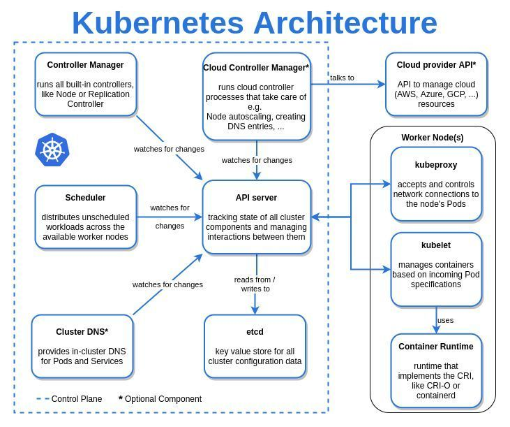
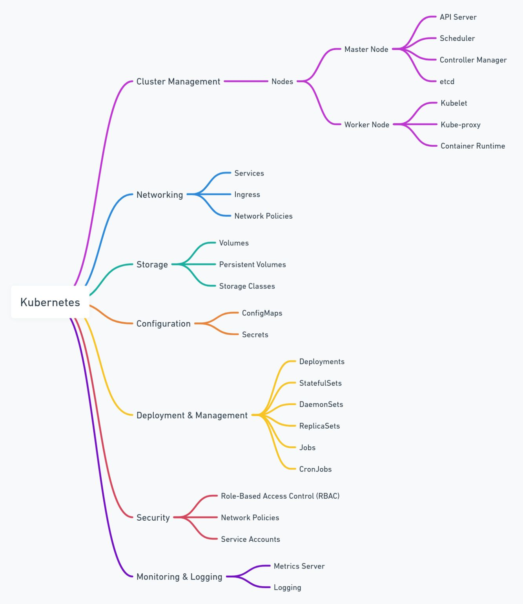
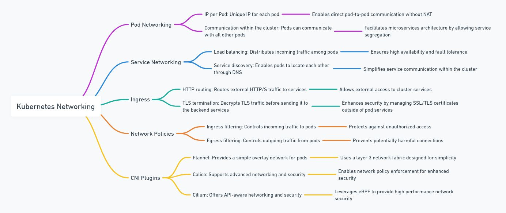
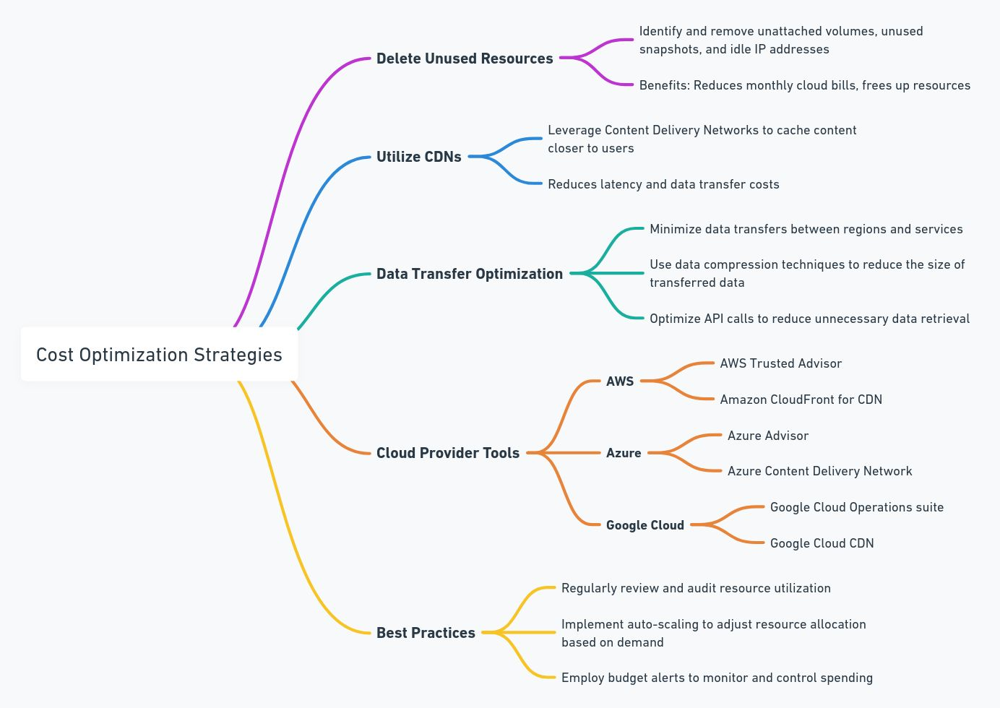
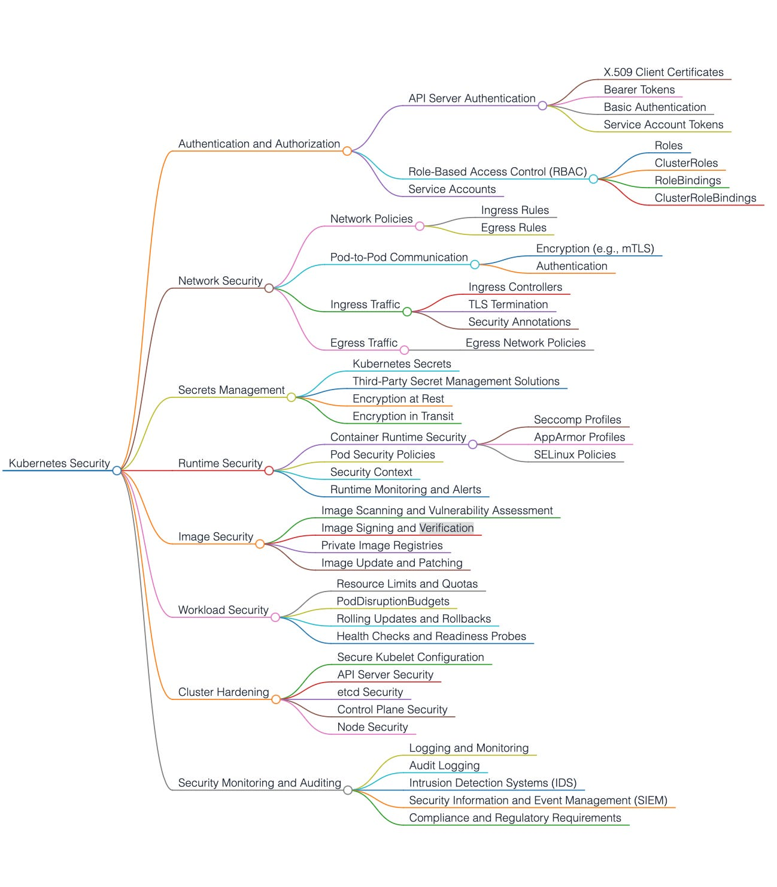

+++
categories = ['Kubernetes']
comments = false
keywords = ['k8s']
showActions = false
showMeta = false
tags = ['k8s']
title = 'K8S Configuration Overview'
+++

## Master Components

## Configuration

## Networking

## Resources Optimization

## Security

