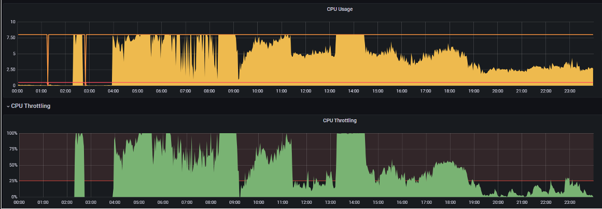
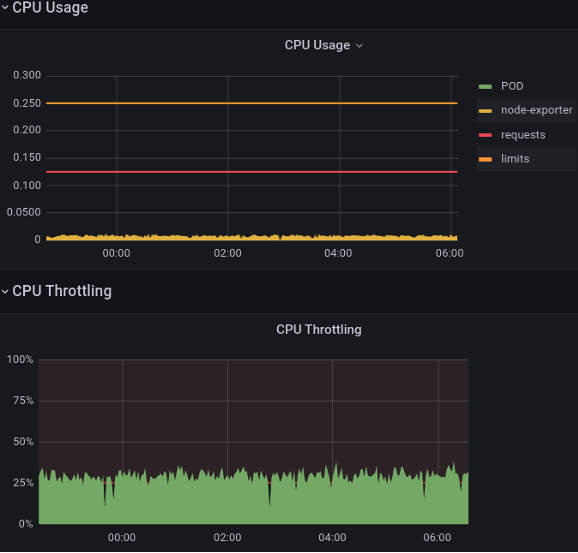
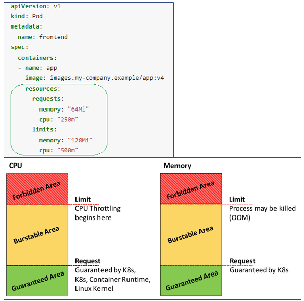
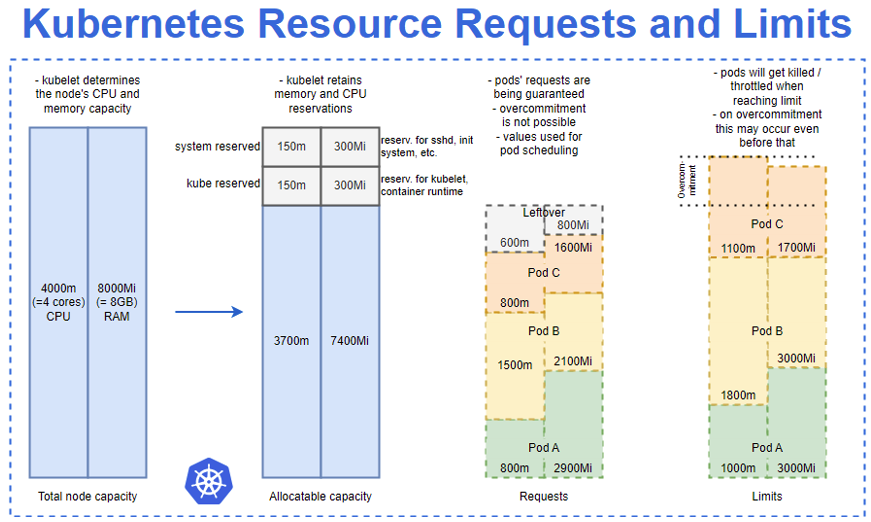
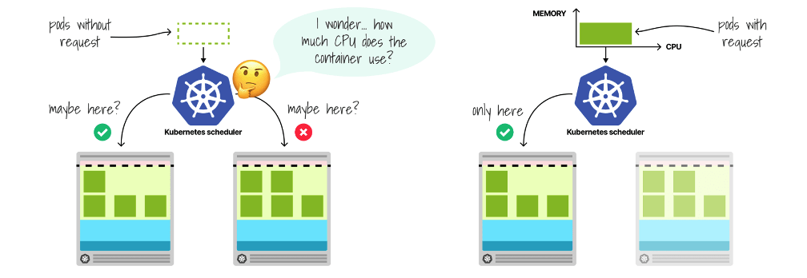
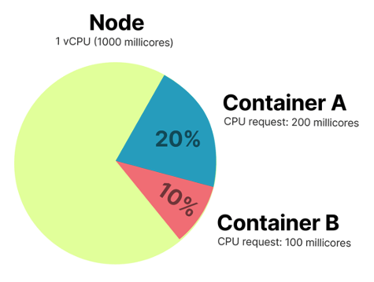
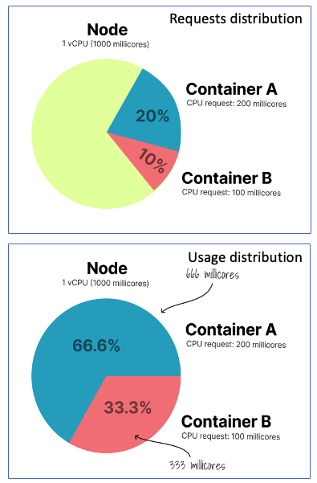
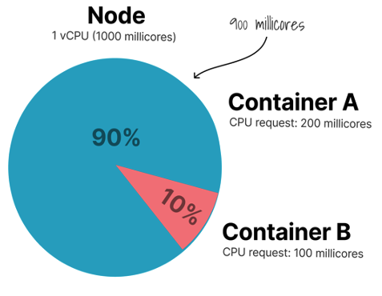
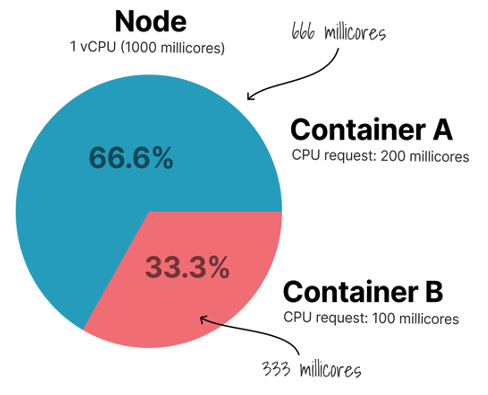
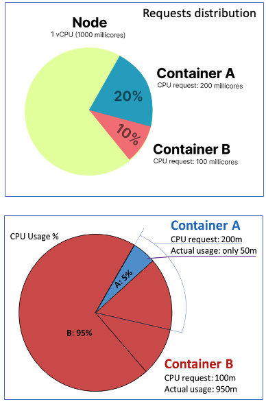

# Kubernetes CPU Requests, Limits, and Throttling

Impacts on Application Performance, some Best Practices

CPU Throttled

## CPU Usage vs CPU Throttling

A random but real example: Grafana CPU Usage vs Throttling reports for a K8s container.

How to explain low CPU Usage, even much below request, but high CPU Throttling?
… and this is commonly faced case.
What does those Throttling mean?
How is Throttling measured?

## CPU Management in Kubernetes: 
Limits, Requests, Throttling

- Requests: Guarantee resources for workloads.
In K8s, they affect how Pods are scheduled on nodes.
Play role as CPU tasks “weight” (priority) during CPU contention on host machine.

- Limits: Cap CPU usage to avoid over-consumption.

K8s CPU and MEM Resources packed onto Node

- CPU Throttling:
The process of limiting CPU usage when tasks or containers exceed their allocated quota (limit), forcing them to pause and wait until the next scheduling period.

## Key Terms and Concepts

CPU: A unit of processing power, which can represent a physical CPU, a CPU core, or a Logical CPU (e.g., a physical core with Hyper-Threading enabled is considered as 2 logical CPUs). In Kubernetes, it's often referred to as a vCPU, equivalent to a share of processing power.

vCPU (virtual CPU) in cloud and/or virtualized environments – out of scope of this DOC but, in short: is a unit of CPU capacity assigned to a container or pod in Kubernetes. It abstracts the underlying physical hardware, allowing Kubernetes to allocate and manage processing resources in a platform-agnostic way.
In most environments, 1 vCPU corresponds to 1 physical CPU or 1 logical CPU (e.g., 1 thread on a hyper-threaded core).
On physical hardware, a single physical CPU core with Hyper-Threading enabled may back 2 vCPUs.
In virtualized environments (e.g., VMs or cloud instances), multiple vCPUs can be over-committed and mapped to the same physical CPU core. For instance:
N:1 mapping: 4 vCPUs could share 1 physical core, with each vCPU getting a fraction of the core's processing power (e.g., 25% if evenly divided).

CPU Time: The total cumulative time a task or group of tasks spends executing on one or more CPUs. This includes time spent running tasks in parallel (on multiple CPUs) or concurrently (on the same CPU) over a defined period.

CPU Usage: Represents the percentage of CPU capacity consumed by a task or group of tasks over a monitored interval of wall-clock time. It’s a rate (e.g., "50% of one CPU" or "2 CPUs used at 80% i.e. 160%"), typically measured in real-time or averaged over intervals.

CPU Usage and CPU Time are related, they are not identical.

"wall-clock" refers to real-world time as you would measure on a regular clock or stopwatch. It tracks the total elapsed time from start to finish, including everything (e.g., waiting, idle, and active time), not just CPU processing time.

Context switching: the process where the Kernel Scheduler saves the state of a running task (e.g., CPU registers, program counter) and restores the state of another task, allowing the CPU to switch between tasks efficiently. This enables multitasking by sharing CPU time among multiple processes or threads.

Task Types in Relation to CPU Access

CPU-Bound Tasks: Spend most of their time on the CPU, continuously running until their processing is complete. These tasks use the CPU intensively and benefit from more CPU time. The scheduler gives them longer CPU slices, but they are preempted if other tasks have higher priority.

I/O-Bound Tasks: Spend less time on the CPU and frequently yield it to wait for I/O (disk, network). They use short bursts of CPU and quickly return to a waiting state, allowing the scheduler to switch to other tasks.

Memory-Bound Tasks: Performance depends on memory access; they alternate between short CPU bursts and waiting for data from RAM, using the CPU sporadically.

Hybrid Tasks: Some workloads exhibit a mix of characteristics (e.g., web servers handling both CPU-intensive request processing and I/O-heavy database access).

## CPU Requests vs K8s Scheduler

Resources (like CPU, MEM) Requests hint K8s Scheduler where (on which node) to bind the pod.

## CPU Requests vs Node 

Following image may be interpreted as CPU Requests booking on the node:
Container A booked 200m CPU or 20% of node Allocatable capacity,
Container B - 100m CPU or 10%, 
For other containers remain 700m CPU or 70% of node Allocatable CPU resource. 

Let interpret pie slices like Real CPU Usage:
Container A and B use exactly amount of CPU they requested. 
What if both wants all the node CPU at the same time? 

Both containers wants all the node CPU at the same time: 
Containers will compete for the same CPU but
K8s will distribute available CPU to them proportionally by their requests (weight).

Use case 1: A is bursting but B is needing now only 100m CPU, so A can use the whole remaining spare CPU, until… 

Use case 2: B is also bursting, so K8s will distribute all available CPU sparely and proportionally to their requests between them… 

Other use-case: “borrowing”
Container A requested 200m (20% of CPU capacity) but it is using now only 50m (5%).
Container B, requested 100m (10%), but it is bursting now and need all CPU, so it may and is using now what is available: 95%
It uses 10% of it’s request + 70% of unused and unreserved + 15% borrowed from A which is reserved/requested by A but not used now, so 95%.

