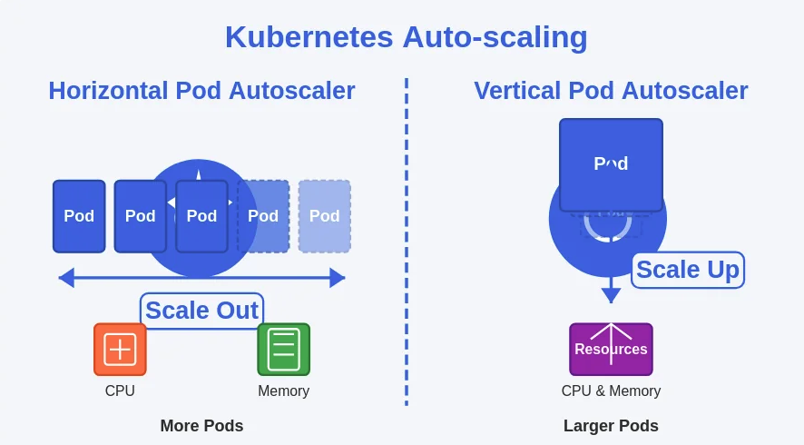
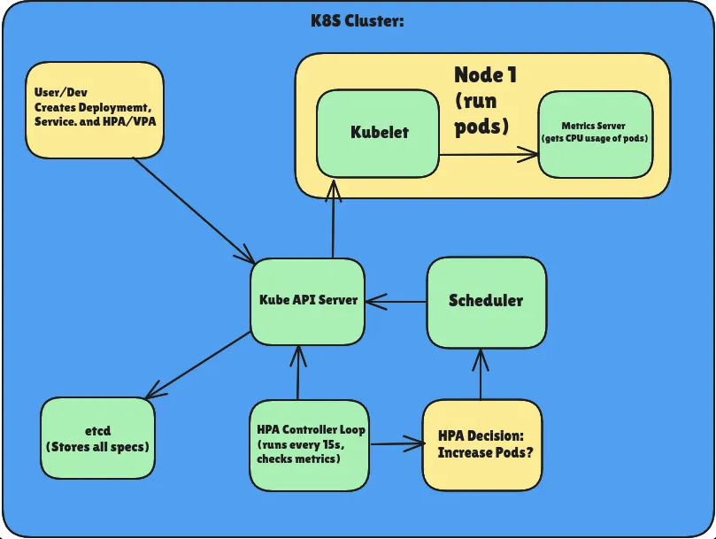
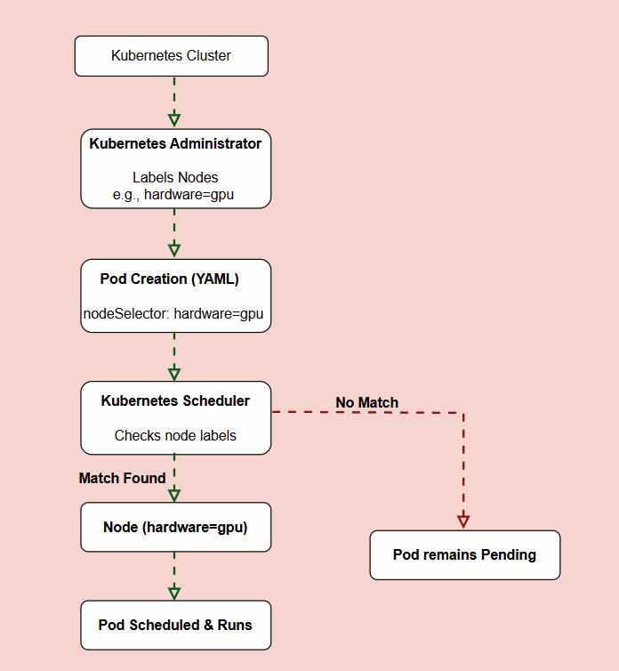

# Kubernetes Automated Cluster Scaling

[algorithm](https://kubernetes.io/docs/tasks/run-application/horizontal-pod-autoscale/#algorithm-details) 

AutoScaling is one of the most powerful concepts in Kubernetes.

This involves two main mechanisms: 

- Horizontal Pod Autoscaling (HPA) 
- Vertical Pod Autoscaling (VPA).

Automated cluster scaling refers to the process of dynamically adjusting the number of running pods (HPA) or their resource allocations (VPA) based on real-time metrics. This ensures that your applications can efficiently handle varying loads without manual intervention.

With HPA, you can scale smarter, and with VPA, scale wiser. HPA handles traffic spikes like a champ.
VPA makes sure your pods get the resources they deserve.






## Horizontal Pod Autoscaling (HPA)

HPA automatically adjusts the number of pods in a deployment or replica set based on observed CPU utilization or other select metrics. For instance, if your application experiences a sudden increase in traffic, HPA will scale out by adding more pods to handle the load. Conversely, it will scale in by reducing the number of pods when the load decreases.

- Manual Scaling (Quick Recap). You manually scale pods using:

```sh
kubectl scale deployment <name> --replicas=5
```

- Limitations: Manual, not reactive to load → not ideal for production.

- Metrics Used: CPU/Memory utilization (via metrics-server).

- Common Use Case: Web app getting heavy traffic → HPA increases pods → load balanced across more pods → better performance.

- Key Fields in HPA YAML:

```yaml
spec:
  scaleTargetRef:
    apiVersion: apps/v1
    kind: Deployment
    name: my-app
  minReplicas: 2
  maxReplicas: 10
  metrics:
    - type: Resource
      resource:
        name: cpu
        target:
          type: Utilization
          averageUtilization: 50
```

```yaml
apiVersion: autoscaling/v1
kind: HorizontalPodAutoscaler
metadata:
  name: my-app-hpa
spec:
  scaleTargetRef:
    apiVersion: apps/v1
    kind: Deployment
    name: my-app
  minReplicas: 2
  maxReplicas: 10
  targetCPUUtilizationPercentage: 50
```

- Deploying the Metrics Server

Why: HPA needs CPU/memory stats → metrics-server collects and exposes these.

Install:

```sh
kubectl apply -f https://github.com/kubernetes-sigs/metrics-server/releases/latest/download/components.yaml
kubectl get deployment metrics-server -n kube-system
```

- Create Pod + Service
Example YAML:

```yaml
apiVersion: apps/v1
kind: Deployment
metadata:
  name: loadapp
spec:
  replicas: 1
  selector:
    matchLabels:
      app: loadapp
  template:
    metadata:
      labels:
        app: loadapp
    spec:
      containers:
      - name: app
        image: k8s.gcr.io/hpa-example
        ports:
        - containerPort: 80
        resources:
          requests:
            cpu: 200m
          limits:
            cpu: 500m
---
apiVersion: v1
kind: Service
metadata:
  name: loadapp-svc
spec:
  selector:
    app: loadapp
  ports:
    - protocol: TCP
      port: 80
      targetPort: 80
```

- Deploy the HPA

```yaml
kubectl autoscale deployment loadapp --cpu-percent=50 --min=1 --max=10
kubectl get hpa
```

- Simulate Load

To make CPU usage spike and trigger autoscaling:

```sh
kubectl run -i --tty load-generator --image=busybox /bin/sh
```

Inside the pod:

```sh
while true; do wget -q -O- http://loadapp-svc.default.svc.cluster.local; done
```

This sends continuous traffic to the service, increasing CPU usage.

- Observe Scaling

```sh
watch kubectl get hpa
```

You’ll see replicas increasing as CPU crosses threshold (e.g., >50%).

```sh
kubectl get pods
```

Eventually:

- More pods created
- CPU usage spread across them
- Load goes down


## Vertical Pod Autoscaling (VPA)

VPA adjusts the resource requests and limits for your containers based on their usage. This means it can increase the CPU and memory allocated to a pod if it is consistently using more resources than initially requested, or it can reduce these allocations if the pod is over-provisioned.

- What it does: Changes the resources (CPU, memory) allocated to each pod.

- Use Case: Workloads where replica count doesn’t need to change, but need more resources.

- Limitations: VPA restarts pods to apply changes.

- Example YAML:

```yaml
apiVersion: autoscaling.k8s.io/v1
kind: VerticalPodAutoscaler
metadata:
  name: my-vpa
spec:
  targetRef:
    apiVersion: "apps/v1"
    kind: Deployment
    name: loadapp
  updatePolicy:
    updateMode: "Auto"
```

Install the VPA components from their official GitHub if not available in your cluster.



# Tolerance

[doc](https://kubernetes.io/blog/2025/04/28/kubernetes-v1-33-hpa-configurable-tolerance/) 

version: Kubernetes v1.33

Tolerances appear under the spec.behavior.scaleDown and spec.behavior.scaleUp fields and can thus be different for scale up and scale down. A typical usage would be to specify a small tolerance on scale up (to react quickly to spikes), but higher on scale down (to avoid adding and removing replicas too quickly in response to small metric fluctuations).

```yaml
apiVersion: autoscaling/v2
kind: HorizontalPodAutoscaler
metadata:
  name: my-app
spec:
  ...
  behavior:
    scaleDown:
      tolerance: 0.05
    scaleUp:
      tolerance: 0
```
