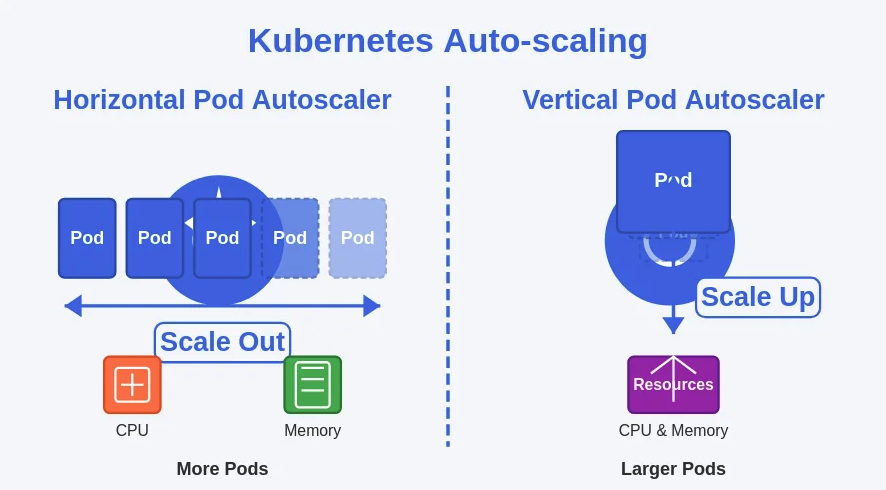
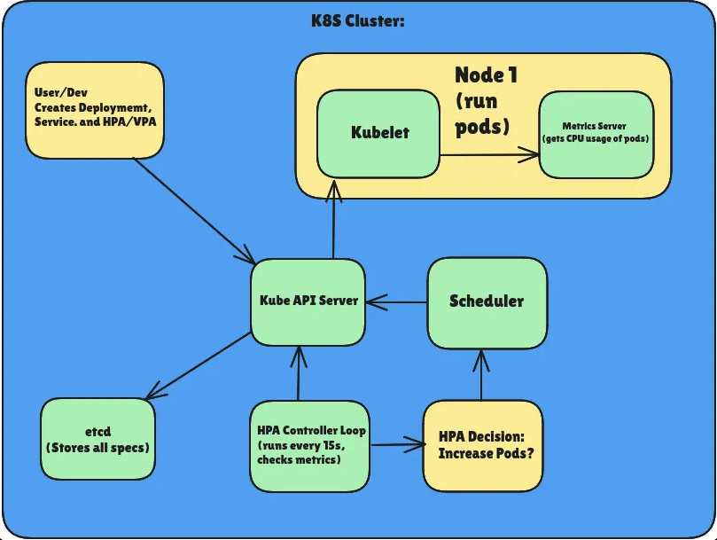
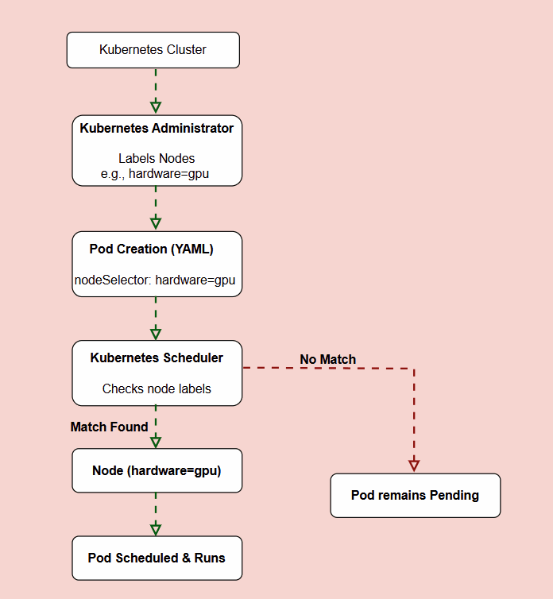

+++
title = 'Kubernetes Automated Cluster Scaling'
date = '2024-08-24'
categories = ['K8s']
tags = ['k8s']
keywords = ['k8s','hpa', 'vpa']
summary = ''
comments = false
showActions = false
showMeta = false
+++

# Kubernetes Automated Cluster Scaling

This involves two main mechanisms: 

- Horizontal Pod Autoscaling (HPA) 
- Vertical Pod Autoscaling (VPA).

Automated cluster scaling refers to the process of dynamically adjusting the number of running pods (HPA) or their resource allocations (VPA) based on real-time metrics. This ensures that your applications can efficiently handle varying loads without manual intervention.

## Horizontal Pod Autoscaling (HPA)

HPA automatically adjusts the number of pods in a deployment or replica set based on observed CPU utilization or other select metrics. For instance, if your application experiences a sudden increase in traffic, HPA will scale out by adding more pods to handle the load. Conversely, it will scale in by reducing the number of pods when the load decreases.


AutoScaling is one of the most powerful concepts in Kubernetes.

explanation and an architecture for HPA (Horizontal Pod Autoscaler) and VPA (Vertical Pod Autoscaler).







With HPA, you can scale smarter, and with VPA, scale wiser. HPA handles traffic spikes like a champ.
VPA makes sure your pods get the resources they deserve

- Manual Scaling (Quick Recap)

    You manually scale pods using:

kubectl scale deployment <name> --replicas=5

    Limitations: Manual, not reactive to load → not ideal for production.

- Horizontal Pod Autoscaler (HPA)
What it does:

    Automatically increases or decreases the number of pods based on resource usage (e.g. CPU, memory).

Metrics Used:

    CPU/Memory utilization (via metrics-server).

Common Use Case:

    Web app getting heavy traffic → HPA increases pods → load balanced across more pods → better performance.

Key Fields in HPA YAML:

spec:
  scaleTargetRef:
    apiVersion: apps/v1
    kind: Deployment
    name: my-app
  minReplicas: 2
  maxReplicas: 10
  metrics:
    - type: Resource
      resource:
        name: cpu
        target:
          type: Utilization
          averageUtilization: 50

- Deploying the Metrics Server
Why?

    HPA needs CPU/memory stats → metrics-server collects and exposes these.

Install:

Usually done via:

kubectl apply -f https://github.com/kubernetes-sigs/metrics-server/releases/latest/download/components.yaml
kubectl get deployment metrics-server -n kube-system

Create Pod + Service
Example YAML:

apiVersion: apps/v1
kind: Deployment
metadata:
  name: loadapp
spec:
  replicas: 1
  selector:
    matchLabels:
      app: loadapp
  template:
    metadata:
      labels:
        app: loadapp
    spec:
      containers:
      - name: app
        image: k8s.gcr.io/hpa-example
        ports:
        - containerPort: 80
        resources:
          requests:
            cpu: 200m
          limits:
            cpu: 500m
---
apiVersion: v1
kind: Service
metadata:
  name: loadapp-svc
spec:
  selector:
    app: loadapp
  ports:
    - protocol: TCP
      port: 80
      targetPort: 80

Deploy the HPA

kubectl autoscale deployment loadapp --cpu-percent=50 --min=1 --max=10
kubectl get hpa

Simulate Load

To make CPU usage spike and trigger autoscaling:

kubectl run -i --tty load-generator --image=busybox /bin/sh

Inside the pod:

while true; do wget -q -O- http://loadapp-svc.default.svc.cluster.local; done

This sends continuous traffic to the service, increasing CPU usage.
Observe Scaling

watch kubectl get hpa

You’ll see replicas increasing as CPU crosses threshold (e.g., >50%).

kubectl get pods

Eventually:

    More pods created
    CPU usage spread across them
    Load goes down


How to Use Automated Cluster Scaling

To implement HPA, you need to define a HorizontalPodAutoscaler resource. Below is an example of how to configure HPA for a deployment:

```yaml
apiVersion: autoscaling/v1
kind: HorizontalPodAutoscaler
metadata:
  name: my-app-hpa
spec:
  scaleTargetRef:
    apiVersion: apps/v1
    kind: Deployment
    name: my-app
  minReplicas: 2
  maxReplicas: 10
  targetCPUUtilizationPercentage: 50
```

In this configuration, HPA will maintain CPU utilization around 50% by scaling the number of replicas between 2 and 10.

## Vertical Pod Autoscaling (VPA)

VPA adjusts the resource requests and limits for your containers based on their usage. This means it can increase the CPU and memory allocated to a pod if it is consistently using more resources than initially requested, or it can reduce these allocations if the pod is over-provisioned.


---Vertical Pod Autoscaler (VPA)
What it does:

    Changes the resources (CPU, memory) allocated to each pod.

Use Case:

    Workloads where replica count doesn’t need to change, but need more resources.

Limitations:

    VPA restarts pods to apply changes.

Example YAML:

apiVersion: autoscaling.k8s.io/v1
kind: VerticalPodAutoscaler
metadata:
  name: my-vpa
spec:
  targetRef:
    apiVersion: "apps/v1"
    kind: Deployment
    name: loadapp
  updatePolicy:
    updateMode: "Auto"

Install the VPA components from their official GitHub if not available in your cluster.




For VPA, you need to define a VerticalPodAutoscaler resource. Here’s an example configuration:

```yaml
apiVersion: autoscaling.k8s.io/v1
kind: VerticalPodAutoscaler
metadata:
  name: my-app-vpa
spec:
  targetRef:
    apiVersion: "apps/v1"
    kind: Deployment
    name: my-app
  updatePolicy:
    updateMode: "Auto"
```

This setup will allow VPA to automatically adjust the CPU and memory requests for the pods in the my-app deployment based on their actual usage.

