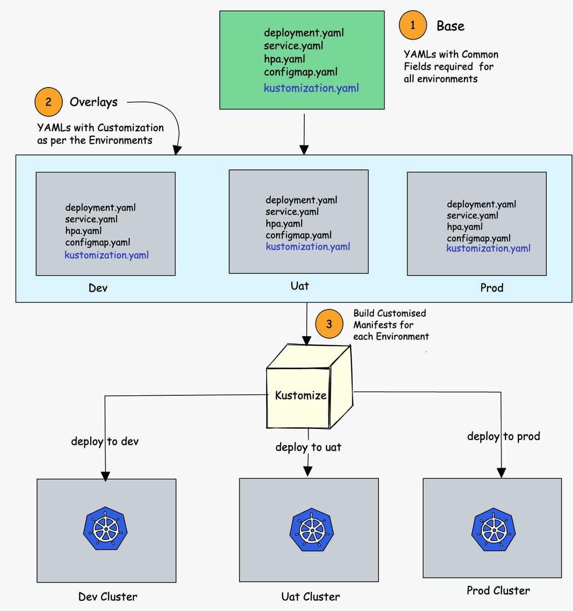
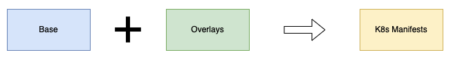
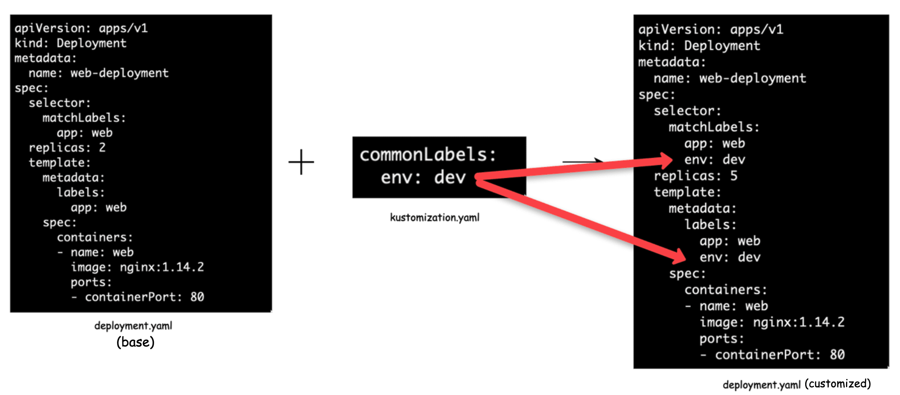
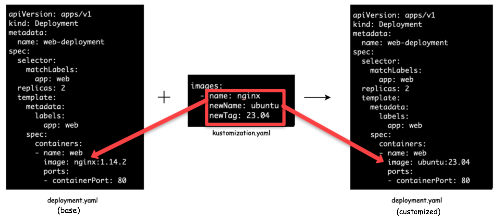
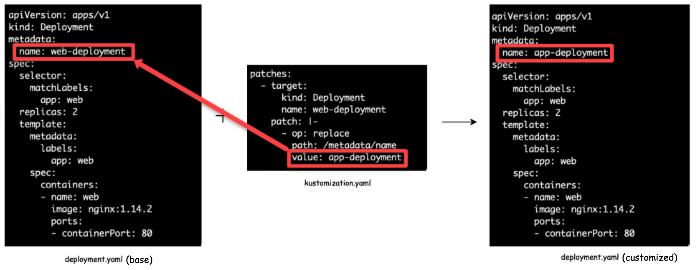
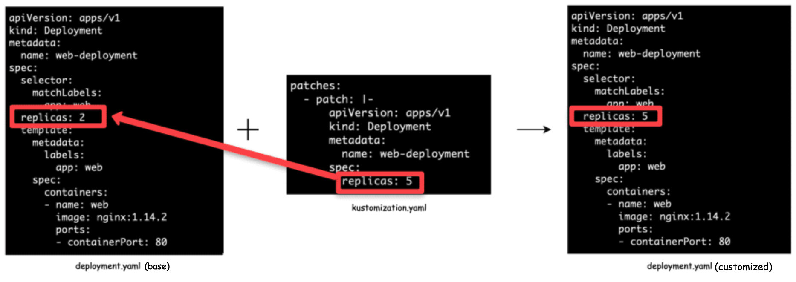

# Kustomize

Kustomize is an open-source configuration management tool for Kubernetes.

It allows you to define and manage Kubernetes objects such as deployments, Daemonsets, services, configMaps, etc for multiple environments in a declarative manner without modifying the original YAML files. To put it simply, you have a single source of truth for YAMLs, and you patch required configurations on top of the base YAMLs as per the environment requirements.

Kustomize has two key concepts, Base and Overlays. With Kustomize we can reuse the base files (common YAMLs) across all environments and overlay (patches) specifications for each of those environments.

Overlaying is the process of creating a customized version of the manifest file (base manifest + overlay manifest = customized manifest file).




## Kustomize Features

The following are the key features of Kustomize:

1. Acts as a configuration tool with declarative configuration same as Kubernetes YAMLs.
2. It can modify resources without altering the original files.
3. It can add common labels and annotations to all the resources.
4. It can Modify container images based on the environment it is being deployed in.
5. Kustomize also ships with secretGenerator and configMapGenerator that use environment files or key-value pairs to create secrets and configMaps.

## kustomization.yamlfile

The kustomization.yaml file is the main file used by the Kustomize tool.

When you execute Kustomize, it looks for the file named kustomization.yaml. This file contains a list of all of the Kubernetes resources (YAML files) that should be managed by Kustomize. It also contains all the customizations that we want to apply to generate the customized manifest.

## Base and Overlays

The Base folder represents the config that going to be identical across all the environments. We put all the Kubernetes manifests in the Base. It has a default value that we can overwrite.

On the other side, the Overlays folder allows us to customize the behavior on a per-environment basis. We can create an Overlay for each one of the environments. We specify all the properties and parameters that we want to overwrite & change.



Basically, Kustomize uses patch directive to introduce environment-specific changes on existing Base standard k8s config files without disturbing them.
Kustomize will check the base deployment file and compare it and patch the changes accordingly. That’s the beauty of Kustomize.


## Transformers

As the name indicates, transformers are something that transforms one config into another. Using Transformers, we can transform our base Kubernetes YAML configs. Kustomize has several built-in transformers. Let’s see some common transformers:

1. commonLabel – It adds a label to all Kubernetes resources
2. namePrefix – It adds a common prefix to all resource names
3. nameSuffix – It adds a common suffix to all resource names
4. Namespace – It adds a common namespace to all resources
5. commonAnnotations – It adds an annotation to all resources

Let’s see an example. In the below image, we have used commonLabels in kustomization.yaml where label env: dev gets added to the customized deployment.yaml.



## Image Transformer

It allows us to modify an image that a specific deployment is going to use.

In the following example, the image transformer checks the nginx image name as mentioned deployment.yaml and changes it to the new name which is ubuntu in the kustomization.yaml file. We can change the tags as well.



## Patches (Overlays)

Patches or overlays provide another method to modify Kubernetes configs. It provides more specific sections to change in the configuration. There are 3 parameters we need to provide:

1. Operation Type: add or remove or replace
2. Target: Resource name which we want to modify
3. Value: Value name that will either be added or replaced. For the remove operation type, there would not be any value.

There are two ways to define the patch:

1. JSON 6902 and
2. Stragetic Merge Patching.

### JSON 6902 Patching

In this way, there are two details that we have to provide, the target and the patch details i.e. operation, path, and the new value.

```yaml
patches:
  - target:
      kind: Deployment
      name: web-deployment
    patch: |-
      - op: replace
        path: /spec/replicas
        value: 5
```



### Stragetic Merge Patching

In this way, all the patch details are similar to a standard k8s config. It would be the original manifest file, we just add the fields that need to be modified.

```yaml
patches:
  - patch: |-
      apiVersion: apps/v1
      kind: Deployment
      metadata:
        name: web-deployment
      spec:
        replicas: 5
```



### Patch From File

For both types of patching, instead of inline configs, we can use the separate file method. Specify all the patch details in a YAML file and refer it to the kustomization.yaml file under the patches directive.

For example, in kustomization.yaml you need to mention the patch file as follows. You need to specify the relative path of the YAML file.

```yaml
patches:
- path: replicas.yaml
```

And we can put the changes in replicas.yaml as given below.

```yaml
apiVersion: apps/v1
kind: Deployment
metadata:
  name: web-deployment
spec:
  replicas: 5
```

## Review & Apply Patches

Let’s review the patches. We can use the below command to review the patches and check whether everything is correct or not.

```sh
kustomize build overlays/dev
```

## Deploy

We can deploy the customized manifest using the following command.

```sh
kustomize build overlays/dev | kubectl apply -f -
```

You can also use the following kubectl command.

```sh
kubectl apply -k overlays/dev
```

## Kustomize Configmap and Secret Generators

Kustomize has the functionality to generate Configmaps and Secrets.

In Kustomization YAML there are two supported fields

- configMapGenerator and
- secretGenerator

## Troubleshooting

While developing or before pushing to git, run kubectl kustomize cfg fmt file_name  command to format the file and set the indentation right. 

