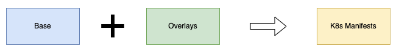

# Kustomize

Kustomize is an official sub-project of Kubernetes and is maintained by the Kubernetes SIG-CLI (Special Interest Group – Command Line Interface) community. It has gained popularity and is widely used in the Kubernetes ecosystem.

Kustomize is an open-source configuration management tool for Kubernetes.

It allows you to define and manage Kubernetes objects such as deployments, Daemonsets, services, configMaps, etc for multiple environments in a declarative manner without modifying the original YAML files. To put it simply, you have a single source of truth for YAMLs, and you patch required configurations on top of the base YAMLs as per the environment requirements.

Kustomize has two key concepts, Base and Overlays. With Kustomize we can reuse the base files (common YAMLs) across all environments and overlay (patches) specifications for each of those environments.

Overlaying is the process of creating a customized version of the manifest file (base manifest + overlay manifest = customized manifest file).


## Kustomize Features and Benefits 

The following are the key features of Kustomize:

1. Acts as a configuration tool with declarative configuration same as Kubernetes YAMLs.
2. It can modify resources without altering the original files.
3. It can add common labels and annotations to all the resources.
4. It can Modify container images based on the environment it is being deployed in.
5. Kustomize also ships with secretGenerator and configMapGenerator that use environment files or key-value pairs to create secrets and configMaps.

Below are the benefits of Kustomize:


- Simplified Configuration Management: Kustomize is easy to use and allows you to manage and customize your Kubernetes configurations more easily by enabling you to define your configuration in a structured and modular way.
- Reusability: With Kustomize we can reuse one of the base files across all environments and overlay specifications for each of those environments. This can save you time and effort by allowing you to reuse common configurations rather than having to create them from scratch for each new deployment.
- Version Control: Kustomize allows you to version control your Kubernetes configurations, making it easier to track changes and roll back to previous configurations if necessary.
- Template Free: Kustomize is template free. It expresses the full power of Kubernetes API, with no need to parameterize every single line compared to Helm.
- Kustomize can be run natively from the Kubernetes command line interface.
- Kustomize has built-in transformers to modify resources and It can be extended via a plug-in mechanism.
- Kustomize does not have any templating language so we can use the usual YAML to state our configurations rapidly.
- Kustomize is provided as a standalone Golang package and cli tool so it’s easy to integrate with users’ tools and workflows.
- We can use Kustomize without installing it if we have kubectl 1.14+ version. kubectl allows us to make declarative changes to our configurations without touching a template.


## kustomization.yamlfile

The kustomization.yaml file is the main file used by the Kustomize tool.

When you execute Kustomize, it looks for the file named kustomization.yaml. This file contains a list of all of the Kubernetes resources (YAML files) that should be managed by Kustomize. It also contains all the customizations that we want to apply to generate the customized manifest.

## Base and Overlays

The Base folder represents the config that going to be identical across all the environments. We put all the Kubernetes manifests in the Base. It has a default value that we can overwrite.

On the other side, the Overlays folder allows us to customize the behavior on a per-environment basis. We can create an Overlay for each one of the environments. We specify all the properties and parameters that we want to overwrite & change.



Basically, Kustomize uses patch directive to introduce environment-specific changes on existing Base standard k8s config files without disturbing them.
Kustomize will check the base deployment file and compare it and patch the changes accordingly. That’s the beauty of Kustomize.


## Transformers

As the name indicates, transformers are something that transforms one config into another. Using Transformers, we can transform our base Kubernetes YAML configs. Kustomize has several built-in transformers. Let’s see some common transformers:

1. commonLabel – It adds a label to all Kubernetes resources
2. namePrefix – It adds a common prefix to all resource names
3. nameSuffix – It adds a common suffix to all resource names
4. Namespace – It adds a common namespace to all resources
5. commonAnnotations – It adds an annotation to all resources

Let’s see an example. In the below image, we have used commonLabels in kustomization.yaml where label env: dev gets added to the customized deployment.yaml.


## Image Transformer

It allows us to modify an image that a specific deployment is going to use.

In the following example, the image transformer checks the nginx image name as mentioned deployment.yaml and changes it to the new name which is ubuntu in the kustomization.yaml file. We can change the tags as well.


## Patches (Overlays)

Patches or overlays provide another method to modify Kubernetes configs. It provides more specific sections to change in the configuration. There are 3 parameters we need to provide:

1. Operation Type: add or remove or replace
2. Target: Resource name which we want to modify
3. Value: Value name that will either be added or replaced. For the remove operation type, there would not be any value.

There are two ways to define the patch:

1. JSON 6902 and
2. Stragetic Merge Patching.

### JSON 6902 Patching

In this way, there are two details that we have to provide, the target and the patch details i.e. operation, path, and the new value.

```yaml
patches:
  - target:
      kind: Deployment
      name: web-deployment
    patch: |-
      - op: replace
        path: /spec/replicas
        value: 5
```


### Stragetic Merge Patching

In this way, all the patch details are similar to a standard k8s config. It would be the original manifest file, we just add the fields that need to be modified.

```yaml
patches:
  - patch: |-
      apiVersion: apps/v1
      kind: Deployment
      metadata:
        name: web-deployment
      spec:
        replicas: 5
```


### Patch From File

For both types of patching, instead of inline configs, we can use the separate file method. Specify all the patch details in a YAML file and refer it to the kustomization.yaml file under the patches directive.

For example, in kustomization.yaml you need to mention the patch file as follows. You need to specify the relative path of the YAML file.

```yaml
patches:
- path: replicas.yaml
```

And we can put the changes in replicas.yaml as given below.

```yaml
apiVersion: apps/v1
kind: Deployment
metadata:
  name: web-deployment
spec:
  replicas: 5
```

## Review & Apply Patches

Let’s review the patches. We can use the below command to review the patches and check whether everything is correct or not.

```sh
kustomize build overlays/dev
```

## Deploy

We can deploy the customized manifest using the following command.

```sh
kustomize build overlays/dev | kubectl apply -f -
```

You can also use the following kubectl command.

```sh
kubectl apply -k overlays/dev
```

## Kustomize Configmap and Secret Generators

Kustomize has the functionality to generate Configmaps and Secrets.

In Kustomization YAML there are two supported fields

- configMapGenerator and
- secretGenerator

Let’s understand what problem it solves.

When you update a configmap attached to a pod as a volume, the configmap data gets propagated to the pod automatically. However, the pod does not get the latest data in the configmap in the following scenarios.

- If the pod gets environment variables from the configmap.
- If the configmap is mounted as a volume using a subpath.

In the above cases, the pod will continue using the old configmap data until we restart the pod. Because the pod is unaware of what got changed in configMap.

Essentially, the data from the ConfigMaps (such as properties, environment variables, etc.) is used by applications during their startup. So even if the updated configmap data is projected to the pod, if the application running inside the pod doesn’t have any hot reload mechanism, you will have to restart the pod for the changes to take place.

What options do we have to solve this issue?

- You can use Reloader Controller.
- Using Kustomize ConfigMap Generator

How the Kustoimize Configmap/Secret generator work.


1. Kustomize generator creates a configMap and Secret with a unique name(hash) at the end. For example, if the name of the configmap is app-configmap, the generated one would have the name app-configmap-7b58b6ct6d. Here 7b58b6ct6d is the appended hash.
2. If you update the configmap/Secret, it will create a new configMap/Secret with the same name with a different hash(random sets of characters) at the end.
3. Kustomize will automatically update the Deployment with the new configmap name.
4. The moment Deployment is updated by Kustomize, a rollout will be triggered and the application runs on the pod and gets the updated configmap/secret data. In this way, we don’t need to redeploy or restart the deployment.


Following are the important points you should know about the Kustomize generators.

- Since Kustomize creates a new configmap every time there is an update, you need to garbage-collect your old orphaned Configmaps. If you have resource quota limits set for namespace, orphaned Configmaps could be an issue. Or you should use the –prune flag with labels in the kubectl apply command. Also, GitOps tools like ArgoCD offer Orphaned resource monitoring mechanisms.
- You can use the disableNameSuffixHash: true flag to disable creating new Configmaps on every update, but it does not trigger a pod rollout. You need to manually trigger a rollout for pods to get the latest configmap data. Or the application running inside the pod should have a hot-reload mechanism.

Here is the file structure of the repository. To understand the generators, we will use the generators overlay folder.

```sh
├── base
│   ├── deployment.yaml
│   ├── kustomization.yaml
│   └── service.yaml
└── overlays
    ├── dev
    │   ├── deployment-dev.yaml
    │   ├── kustomization.yaml
    │   └── service-dev.yaml
    ├── generators
    │   ├── deployment.yaml
    │   ├── files
    │   │   └── index.html
    │   ├── kustomization.yaml
    │   └── service.yaml
    └── prod
        ├── deployment-prod.yaml
        ├── kustomization.yaml
        └── service-prod.yaml
```

The configmap generation options should be added to the kustomization.yaml file under configMapGenerator field. 

If you want to prune the orphaned Configmaps, use the –prune flag with the configmap label as shown below. The --prune flag instructs Kustomize to remove any resources from the final output that is no longer referenced or required.

```sh
kustomize build overlays/generators | kubectl apply --prune -l app=web-service  -f -
```

### Disabling Hashed ConfigMap

If you don’t want to create hashed Configmaps using the ConfigMap generator, you can disable it by setting the disableNameSuffixHash flag to true under generatorOptions. It will disable the hash for all the Configmaps mentioned in the kustomization.yaml file.

```yaml
generatorOptions:
  labels:
    app: web-service
  disableNameSuffixHash: true
```

Note: If you disable Configmap hash, you need to manually restart the pods for the configmap data to be consumed by the application.

## Generate Secrets Using Kustomize

You can generate secrets the same way you generate Configmaps.

For generating secrets, you need to use the secretGenerator field.

Here is an example of generating a secret object from a file.

```yaml
secretGenerator:
- name: nginx-secret
  files:
  - files/secret.txt
```

If you want to generate secrets from literals, use the following format.

```yaml
secretGenerator:
- name: nginx-api-password
  literals:
  - password="myS3cret"
```

You can mount the secret as a volume or propagate it as an environment variable as per your requirements.

## Troubleshooting

While developing or before pushing to git, run kubectl kustomize cfg fmt file_name  command to format the file and set the indentation right. 

