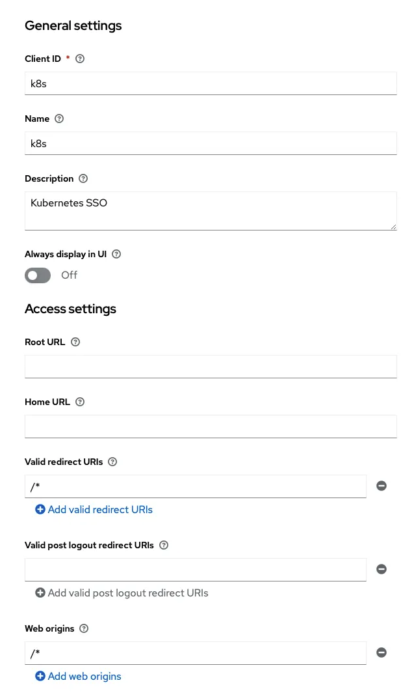
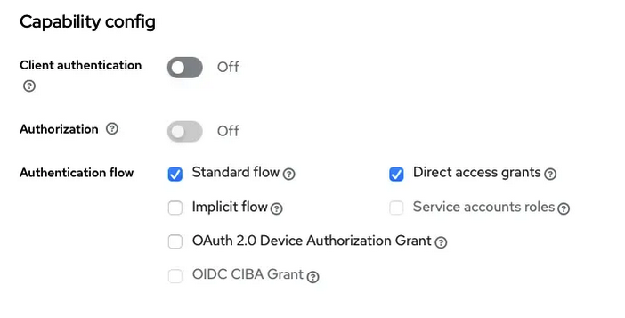
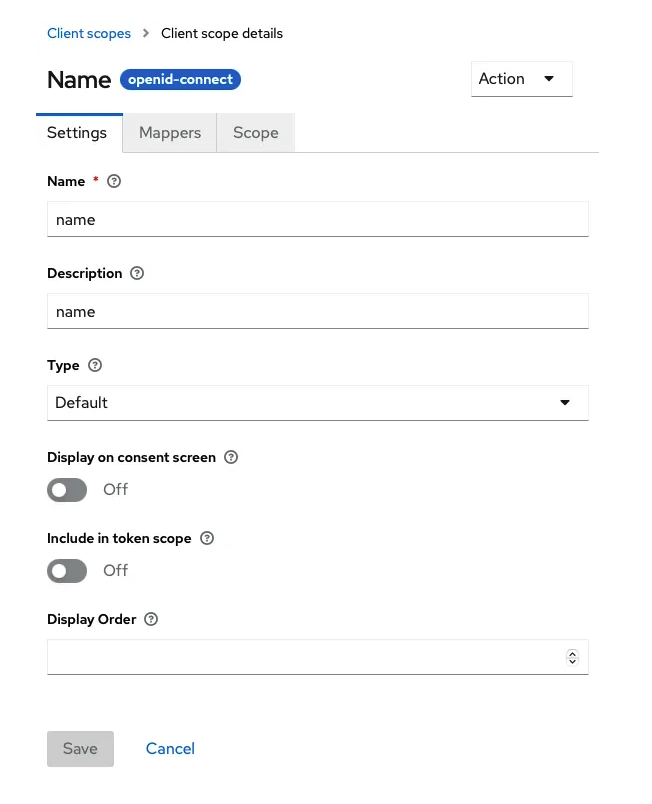
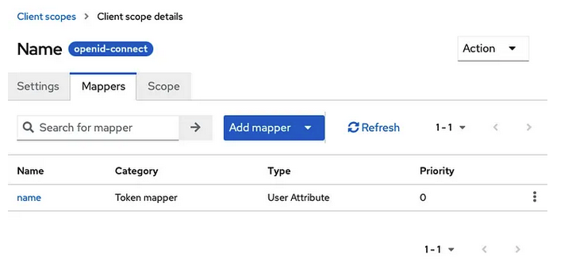
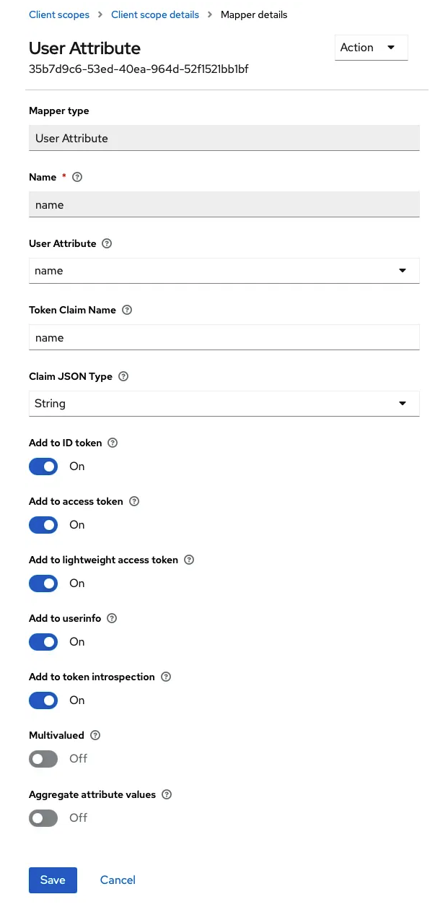
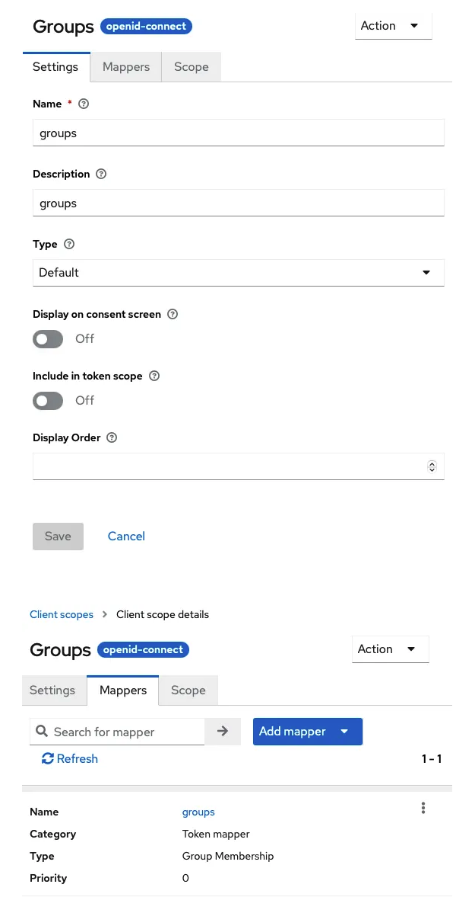
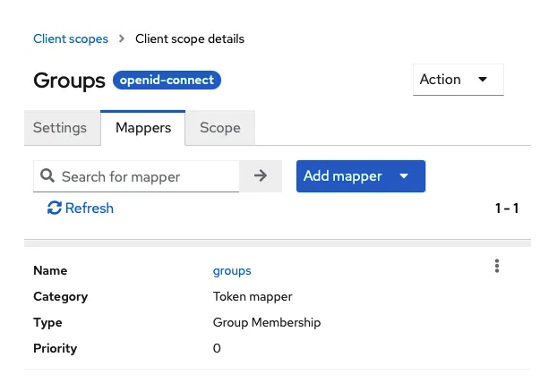
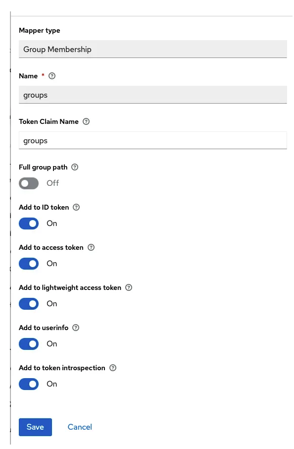
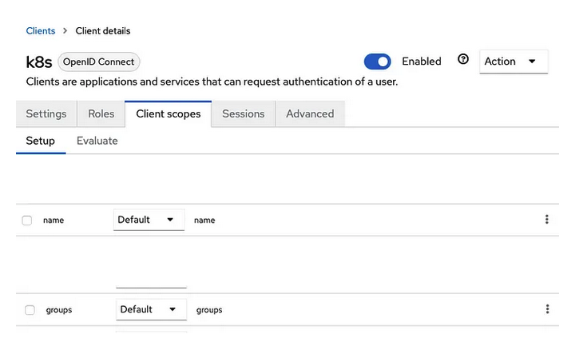
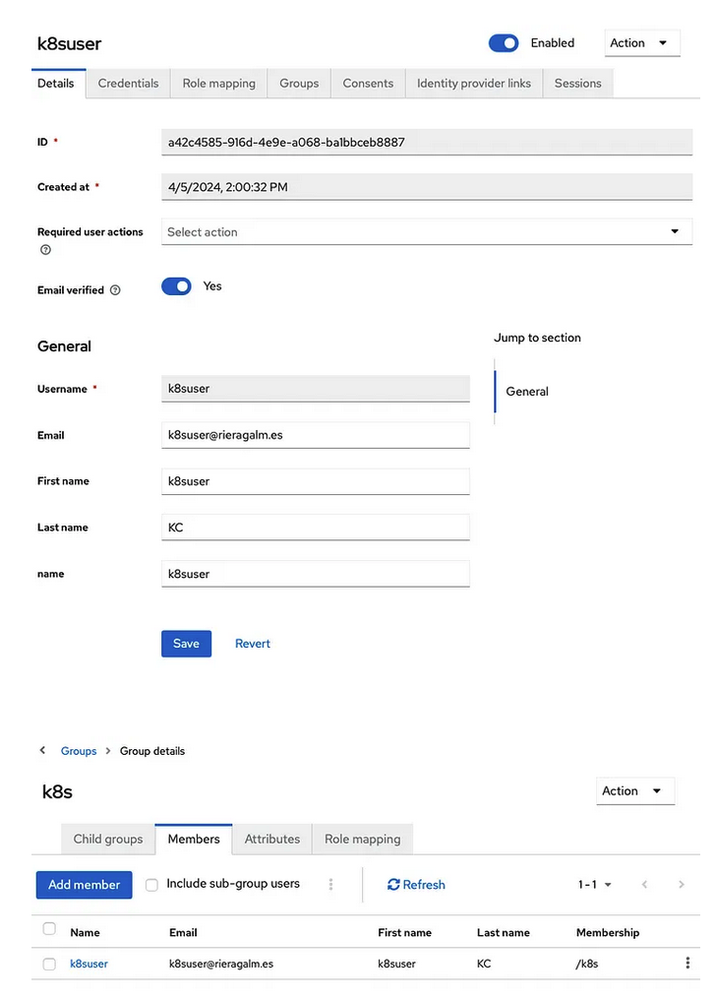

# Keycloak as an OIDC provider for Kubernetes

The workflow

1. The client requests an ID Token with claims for it’s identity (name) and the groups he/she belongs to
2. The client then requests access to Kubernetes providing the ID token from the IDP obtained previously
3. This token (which contains the claims for name, group ) is used in each request to the API Server
4. The API Server in turn checks the ID Token validity with the ID provider
5. If the token is valid, then the API Server will check if the request is authorized based on the token’s claims and the configured RBAC (by matching it with the corresponding resources)
6. Finally, the actions will be performed or denied
7.  A response is sent back to the client

From the user perspective, once everything is setup, we will perform this actions to obtain access to the cluster:

1. Get an ID Token (and Refresh token) from the ID provider (we will request the tokens from Keycloak).
2. Set a user’s credentials for kubectl .
3. Set a new kubectl config with this user and a configured cluster (for example, minikube )
4. Done: Use the config, issue commands

From the Keycloak admin’s perspective, we will:

1. Create a client (in our example, a public client, i.e.: no client secret)
2. Create some basic claims for identification and management of users and groups, specifically:
   - name
   - groups
3. Place the target users within the corresponding group

From the Kubernetes admin’s perspective, we will:

1. Configure the required RBAC resources: for example, a ClusterRole with the permitted operations and a ClusterRoleBinding that matches the desired group.
2. Configure the API Server to use Keycloak as an OIDC provider

## Configure a Keycloak client for Kubernetes SSO

```json
{
  "clientId": "k8s",
  "name": "k8s",
  "description": "Kubernetes SSO",
  "rootUrl": "",
  "adminUrl": "",
  "baseUrl": "",
  "surrogateAuthRequired": false,
  "enabled": true,
  "alwaysDisplayInConsole": false,
  "clientAuthenticatorType": "client-secret",
  "redirectUris": [
    "/*"
  ],
  "webOrigins": [
    "/*"
  ],
  "notBefore": 0,
  "bearerOnly": false,
  "consentRequired": false,
  "standardFlowEnabled": true,
  "implicitFlowEnabled": false,
  "directAccessGrantsEnabled": true,
  "serviceAccountsEnabled": false,
  "publicClient": true,
  "frontchannelLogout": true,
  "protocol": "openid-connect",
  "attributes": {
    "oidc.ciba.grant.enabled": "false",
    "oauth2.device.authorization.grant.enabled": "false",
    "backchannel.logout.session.required": "true",
    "backchannel.logout.revoke.offline.tokens": "false"
  },
  "authenticationFlowBindingOverrides": {},
  "fullScopeAllowed": true,
  "nodeReRegistrationTimeout": -1,
  "defaultClientScopes": [
    "web-origins",
    "acr",
    "profile",
    "roles",
    "name",
    "groups",
    "email"
  ],
  "optionalClientScopes": [
    "address",
    "phone",
    "offline_access",
    "microprofile-jwt"
  ],
  "access": {
    "view": true,
    "configure": true,
    "manage": true
  }
}
```




- I am allowing all redirects and all web origins, though this is less than desirable in production.
- Please change this values to your redirect URLs to enhance the security.




- I have let only the Standard Flow and the Direct access (for username and password sing-in).

## Configuring the name and groups claims

We want to make those two claims available in the ID token. For that we will:

- Create new client scopes and
- Specify how to map them to the token
- Configure those new scopes in the Keycloak client that we created for Kubernetes authentication










The group scope:










Gotchas

- Forgetting to strip the path from the groups’s name
- Forgetting to add this to the ID Token!
- Forgetting to add this to the user info (if you plan to validate the token before submitting it in each request)

The “Kubernetes” Client, Client Scopes configuration:

- Add the client scopes name and groups
- Make them Default so that’s easier later on




## Common CLI environment variables

To make it easier to go through the rest of the steps we will use some environment variables:

```sh
export REALM='the_realm_that_contains_the_k8s_client'
export OIDC_SERVER='https://your.keycloak.server.local:8443'
export OIDC_ISSUER_URL="${OIDC_SERVER}/realms/${REALM}"
export OIDC_CLIENT_ID=k8s
export OIDC_TOKEN_ENDPOINT=$(curl "${OIDC_ISSUER_URL}/.well-known/openid-configuration" | jq -r '.token_endpoint')
export OIDC_USERINFO_ENDPOINT=$(curl "${OIDC_ISSUER_URL}/.well-known/openid-configuration" | jq -r '.userinfo_endpoint')
```

## K8S: Configure Kubernetes API Server

We will setup minikube passing the configuration flags for the API Server directly from the command line.

```sh
# minikube setup
minikube start --driver docker --cpus 8 --memory max --profile minikube \
--embed-certs \
--extra-config=apiserver.authorization-mode=Node,RBAC \
--extra-config=apiserver.oidc-issuer-url=${OIDC_ISSUER_URL} \
--extra-config=apiserver.oidc-client-id=${OIDC_CLIENT_ID} \
--extra-config=apiserver.oidc-username-claim=name \
--extra-config=apiserver.oidc-username-prefix=- \
--extra-config=apiserver.oidc-groups-claim=groups \
--extra-config=apiserver.oidc-groups-prefix=
```

Command Line breakdown

— embed-certs : adds the certificates placed under $HOME/.minikube/certs/
— extra-config=apiserver.authorization-mode=Node,RBAC : this adds RBAC to the cluster while maintaining the local node access (to prevent lockout).
— extra-config=apiserver.oidc-issuer-url=${OIDC_ISSUER_URL} : the issuer URL (which is the URL with the realm, or in case of another OpenID provider, the URL where you can then find the .well-known/openid-configuration
— extra-config=apiserver.oidc-client-id=${OIDC_CLIENT_ID} : the client ID (in our case, the name of the client in the real)
— extra-config=apiserver.oidc-username-claim=name : the username claim from the token.
— extra-config=apiserver.oidc-username-prefix=- : intentionally configured with a single dash, which prevents any prefix to be appended to the name-
— extra-config=apiserver.oidc-groups-claim=groups : the configuration for the group name.
— extra-config=apiserver.oidc-groups-prefix= : this one is intentionally left blank to prevent the API Server to add any prefix (like - to the groups’ names)

Gotchas

    The config is not yet ready or you have not configured an alternative to RBAC
    The certificate is not trusted (because it is self-signed or it is not available in the trust store)

## K8S: Configure RBAC

For now, we will create a ClusterRole and a ClusterRoleBinding to demonstrate how to create how to grant “ReadOnly” rights to Namespaces and Pods within the cluster:

```yaml
# rbac.yaml

kind: ClusterRole
apiVersion: rbac.authorization.k8s.io/v1
metadata:
  name: k8s-ro
rules:
  - apiGroups: [""]
    resources: ["namespaces","pods"]
    verbs: ["get", "watch", "list"]
---
kind: ClusterRoleBinding
apiVersion: rbac.authorization.k8s.io/v1
metadata:
  name: k8s-ro
roleRef:
  apiGroup: rbac.authorization.k8s.io
  kind: ClusterRole
  name: k8s-ro
subjects:
- kind: Group
  name: "k8s"
  apiGroup: rbac.authorization.k8s.io
```

How does this work?

The ClusterRole defines which operations can be performed on the API Server and the ClusterRoleBinding matches the role with a specific subject: notice the subjects code block:

It references the name k8s of kind Group

By assigning this group (“k8s”) to our users they will get RO access to the clusters’ namespaces and pods.

Apply the config using the current local node credentials:

kubectl apply -f rbac.yaml
Configure the Client (kubectl)

As explained in the introductory section, we will first obtain an ID token and then configure kubectl with it.

For this purpose, I will create a user called k8suser in Keycloak and assign it the group k8s . You can skip this part if you have other users and or groups, just adjust to your needs:




Preparing the command line to request the ID Token

For this purpuse I will use curl and jq to get a response from Keycloak.

I will then extract the tokens and use them to configure kubectl .

```sh
# Prepare some credentials
export K8S_USER='k8suser'
export K8S_USER_PASS='THE_USER_PASS'
```

```sh
export RESPONSE=$(curl -v -k -X POST \
-H "Content-Type: application/x-www-form-urlencoded" \
"${OIDC_TOKEN_ENDPOINT}" \
-d grant_type=password \
-d client_id=${OIDC_CLIENT_ID} \
-d username=${K8S_USER} \
-d password=${K8S_USER_PASS} \
-d scope="openid profile email name groups" | jq '.')
```

Extract the tokens:

```sh
export ID_TOKEN=$(echo $RESPONSE| jq -r '.id_token')
export REFRESH_TOKEN=$(echo $RESPONSE| jq -r '.refresh_token')
export ACCESS_TOKEN=$(echo $RESPONSE| jq -r '.access_token')
```

Now we can optionally check if we received all the information that we need by querying the user info endpoint with the access token.

Afterwards we do not need the access token anymore and we could discard it.

```sh
curl -s -H "Content-Type: application/x-www-form-urlencoded" \
-H "Authorization: Bearer ${ACCESS_TOKEN}" \
"${OIDC_USERINFO_ENDPOINT}" | jq '.'

{
  "sub": "a42c4585-916d-4e9e-a068-ba1bbceb8887",
  "email_verified": true,
  "name": "k8suser",
  "groups": [
    "k8s"
  ],
  "preferred_username": "k8suser",
  "given_name": "k8suser",
  "family_name": "KC",
  "email": "k8suser@rieragalm.es"
}
```

Note: Check that name and groups appear and they are populated properly!

Gotchas

    You forgot to make the claims default or you are not requesting those scopes, so there are not available in the ID Token

Kubectl: create a set of credentials

Now that we have the tokens, let’s create a new set of kubectl credentials!

```sh
kubectl config set-credentials ${K8S_USER} \
   --auth-provider=oidc \
   --auth-provider-arg=idp-issuer-url=${OIDC_ISSUER_URL} \
   --auth-provider-arg=client-id=${OIDC_CLIENT_ID} \
   --auth-provider-arg=refresh-token=${REFRESH_TOKEN} \
   --auth-provider-arg=id-token=${ID_TOKEN}
```

Now we have to create a new configuration context to use this newly created user in an existing cluster:

```sh
kubectl config set-context ${K8S_USER} \
--cluster=minikube \
--user=${K8S_USER} \
--namespace=default
```

And finally we need to use it:

```sh
kubectl config use-context ${K8S_USER}
```

Kubectl: check the access

We will now check our identity and we will try to perform a `get` operation to get the pods on the cluster:

```sh
kubectl auth whoami
ATTRIBUTE   VALUE
Username    k8suser
Groups      [k8s system:authenticated]


kubectl auth can-i get pods
yes

kubectl auth can-i get deployments.apps
no
```

```sh
ubectl get pods -A
NAMESPACE     NAME                                      READY   STATUS    RESTARTS        AGE
kube-system   coredns-5dd5756b68-7xkmd                  1/1     Running   2 (2d18h ago)   2d23h
kube-system   etcd-minikube-docker                      1/1     Running   3 (2d18h ago)   2d23h
kube-system   kube-apiserver-minikube-docker            1/1     Running   1 (2d18h ago)   2d22h
kube-system   kube-controller-manager-minikube-docker   1/1     Running   3 (2d18h ago)   2d23h
kube-system   kube-proxy-cbjf9                          1/1     Running   2 (2d18h ago)   2d23h
kube-system   kube-scheduler-minikube-docker            1/1     Running   3 (2d18h ago)   2d23h
kube-system   storage-provisioner                       1/1     Running   5 (2d18h ago)   2d23h
```

```sh
kubectl get deployments.apps
Error from server (Forbidden): deployments.apps is forbidden: User "k8suser" cannot list resource "deployments" in API group "apps" in the namespace "default"
```


