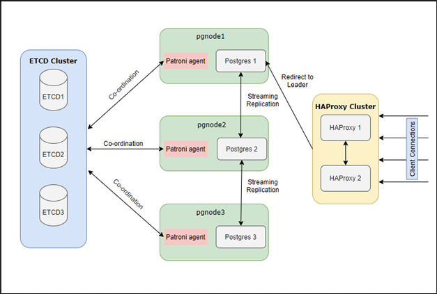
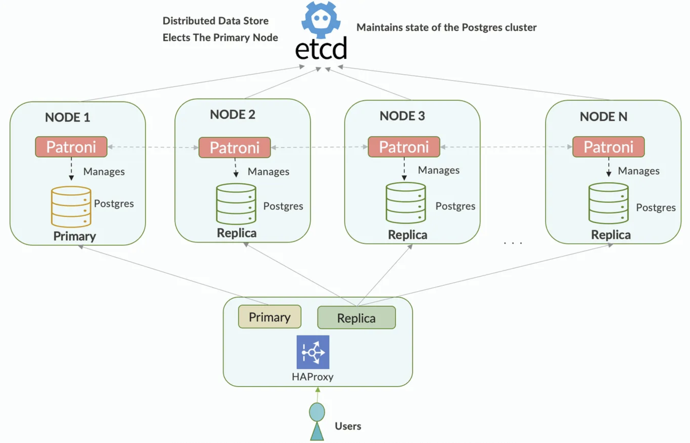
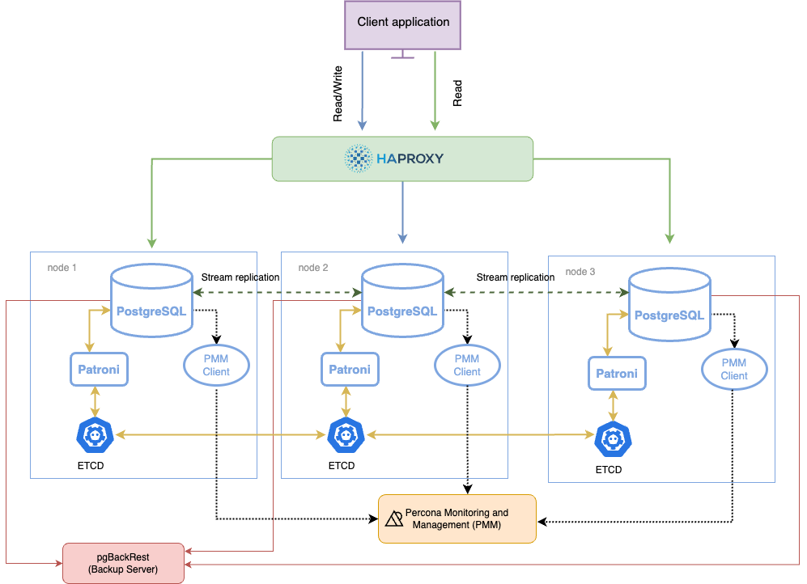
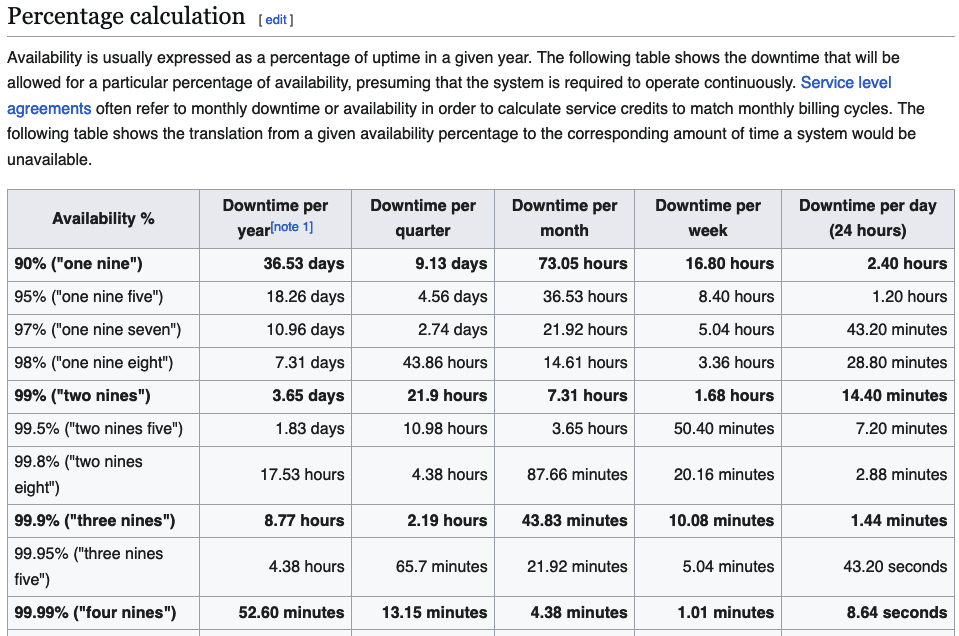

# High Availability in PostgreSQL with Patroni

Percona Distribution for PostgreSQL provides the best and most critical enterprise components from the open-source community, in a single distribution, designed and tested to work together.

[Reference](https://docs.percona.com/postgresql/17/) 

 

Components include:

- PostGIS support for geographic objects.
- pg_repack rebuilds PostgreSQL database objects. 
- pgAudit provides detailed session or object audit logging via the standard PostgreSQL logging facility.
- pgAudit set_user – The set_user part of pgAudit extension provides an additional layer of logging and control when unprivileged users must escalate themselves to superuser or object owner roles in order to perform needed maintenance tasks.
- pgBackRest is a backup and restore solution for PostgreSQL.
- Patroni is an HA (High Availability) solution for PostgreSQL.
- pg_stat_monitor collects and aggregates statistics for PostgreSQL and provides histogram information.
- PgBouncer – a lightweight connection pooler for PostgreSQL.
- pgBadger – a fast PostgreSQL Log Analyzer.
- wal2json – a PostgreSQL logical decoding JSON output plugin.
- HAProxy – a high-availability and load-balancing solution.
- etcd– a distributed, reliable key-value store for setting up highly available Patroni clusters
- pgpool-ll – a middleware between PostgreSQL server and client for high availability, connection pooling and load balancing.

- Failure Scenarios and How the Cluster Recovers From Them
By unplugging network and power cables, killing main processes, attempting to saturate processors. All of this while continuously writing and reading data from PostgreSQL. The idea was to see how Patroni would handle the failures and manage the cluster to continue delivering service.


## My Architecture




## Patroni 

[Reference](https://patroni.readthedocs.io/en/latest/) 

PostgreSQL has been widely adopted as a modern, high-performance transactional database. A highly available PostgreSQL cluster can withstand failures caused by network outages, resource saturation, hardware failures, operating system crashes or unexpected reboots. Such cluster is often a critical component of the enterprise application landscape, where four nines of availability is a minimum requirement. 

Is a template for you to create your own customized, high-availability solution using Python and - for maximum accessibility - a distributed configuration store like ZooKeeper, etcd, Consul or Kubernetes.

Patroni is best candidate to choose for HA and DR setup. Also if you know little bit of Python you can easily read the code and change it according to your needs. Patroni also provides REST APIs to automate things on top of the existing functionalities.

Patroni is open source HA template for PostgreSQL written in Python which can be deployed easily on Kubernetes or VMs. It can be integrated with ETCD, Consul or Zookeeper as consensus store.

When the leader is down, one of the replicas will be chosen as the new leader with the help of etcd.
This configuration may be extended to include more replicas, and pgbouncer can be used to pool connections to the database.

Patroni is open source library and does not come with enterprise support, you need to depend on open source community for any unforeseen issues or bugs. Although there are managed services available for Patroni.

- Solution Architecture:
Here we have used 8 VMs to avoid SPOF and achieve High Availability on Postgres.

 

Key benefits of Patroni:

- Continuous monitoring and automatic failover
- Manual/scheduled switchover with a single command
- Built-in automation for bringing back a failed node to cluster again.
- REST APIs for entire cluster configuration and further tooling.
- Provides infrastructure for transparent application failover
- Distributed consensus for every action and configuration.
- Integration with Linux watchdog for avoiding split-brain syndrome.

- Architecture layout

The following diagram shows the architecture of a three-node PostgreSQL cluster with a single-leader node.

 

- Components

The components in this architecture are:

- PostgreSQL nodes
- Patroni - a template for configuring a highly available PostgreSQL cluster.
- etcd - a Distributed Configuration store that stores the state of the PostgreSQL cluster.
- HAProxy - the load balancer for the cluster and is the single point of entry to client applications.
- pgBackRest - the backup and restore solution for PostgreSQL
- Percona Monitoring and Management (PMM) - the solution to monitor the health of your cluster

- How components work together

Each PostgreSQL instance in the cluster maintains consistency with other members through streaming replication. Each instance hosts Patroni - a cluster manager that monitors the cluster health. Patroni relies on the operational etcd cluster to store the cluster configuration and sensitive data about the cluster health there.

Patroni periodically sends heartbeat requests with the cluster status to etcd. etcd writes this information to disk and sends the response back to Patroni. If the current primary fails to renew its status as leader within the specified timeout, Patroni updates the state change in etcd, which uses this information to elect the new primary and keep the cluster up and running.

The connections to the cluster do not happen directly to the database nodes but are routed via a connection proxy like HAProxy. This proxy determines the active node by querying the Patroni REST API.

```py
$  pip show patroni
Name: patroni
Version: 4.0.1
Summary: PostgreSQL High-Available orchestrator and CLI
Home-page: https://github.com/patroni/patroni
Author: Alexander Kukushkin, Polina Bungina
Author-email: akukushkin@microsoft.com, polina.bungina@zalando.de
License: The MIT License
Location: /usr/lib/python3/dist-packages
```

### What does Patroni do?

Basically, everything you need to run highly available PostgreSQL clusters!
Patroni creates the cluster, initiates streaming replication, handles synchronicity requirements, monitors liveliness of primary and replica, can change the configuration of all cluster members, issues reload commands and restarts selected cluster members, handles planned switchovers and unplanned failovers, rewinds a failed primary to bring it back in line and reinitiates all replication connections to point to the newly promoted primary.

Patroni is engineered to be very fault tolerant and stable; By design, split-brain scenarios are avoided. Split-brain occurs when two members of the same cluster accept writing statements.
It guarantees that certain conditions are always fulfilled and despite the automation of so many complex tasks, it shouldn't corrupt the database cluster nor end in a situation where recovery is impossible.
**For example** , Patroni can be told never to promote a replica that is lagging behind the primary by more than a configurable amount of log.

It also fulfils several additional requirements; for example, certain replicas should never be considered for promotion if they exist only for the purpose of archiving or data lake applications and not business operations.

The architecture of Patroni is such that every PostgreSQL instance is accompanied by a designated Patroni instance that monitors and controls it.

All of the data that Patroni collects is mirrored in a distributed key-value store, and based on the information present in the store, all Patroni instances agree on decisions, such as which replica to promote if the primary has failed.
The distributed key-value store, for example etcd or consul, enables atomic manipulation of keys and values. This forwards the difficult problem of cluster consensus (which is critical to avoid the split-brain scenario) to battle tested components, proven to work correctly even under the worst circumstances.

Some of the data collected by Patroni is also exhibited through a ReST interface, which can be useful for monitoring purposes as well as for applications to select which PostgreSQL instance to connect to.

## High availability methods

Why native streaming replication is not enough

Although the native streaming replication in PostgreSQL supports failing over to the primary node, it lacks some key features expected from a truly highly-available solution. These include:

- No consensus-based promotion of a “leader” node during a failover
- No decent capability for monitoring cluster status
- No automated way to bring back the failed primary node to the cluster
- A manual or scheduled switchover is not easy to manage

To address these shortcomings, there are a multitude of third-party, open-source extensions for PostgreSQL. The challenge for a database administrator here is to select the right utility for the current scenario.

Percona Distribution for PostgreSQL solves this challenge by providing the Patroni extension for achieving PostgreSQL high availability.

There are several native methods for achieving high availability with PostgreSQL:

- shared disk failover,
- file system replication,
- trigger-based replication,
- statement-based replication,
- logical replication,
- Write-Ahead Log (WAL) shipping, and
- streaming replication


 

# Software & Hardware

## [ETCD](https://etcd.io/) 

Patroni supports a myriad of systems for Distribution Configuration Store but etcd remains a popular choice. 

- Distributed Consensus Store (DCS): Patroni requires a DCS system, such as ETCD, Consul, or Zookeeper, to store vital configuration data and real-time status information of the nodes. We will use odd number (>1) of servers here we are using 3 nodes with minimum configuration.

Etcd stores the state of the PostgreSQL cluster. When any changes in the state of any PostgreSQL node are found, Patroni updates the state change in the ETCD key-value store. ETCD uses this information to elect the master node and keep the cluster up and running.
The process of electing a leader involves making an attempt in Etcd to set an expired key. The primary database is determined to be the PostgreSQL instance that, via its bot, sets the Etcd key first. Etcd utilizes a Raft-based consensus method to guard against the occurrence of race situations. Following the receipt of confirmation that it is in possession of the key, a bot will configure the PostgreSQL instance to function as the primary database. The election of a primary will be visible to all other nodes, at which point their bots will configure their PostgreSQL instances to function as replicas.

- Use a larger Etcd cluster to improve availability: if one Etcd node fails, it will not affect our Postgres servers.
- Use **PgBouncer** to pool connections.

## HAProxy
- Load Balancer (e.g., HAProxy): A crucial element in the setup is a load balancer, like HAProxy. It plays a pivotal role in distributing incoming traffic across the PostgreSQL instances, ensuring all traffic should go to only master node. We will use two machines with minimum configuration - you can also utilize 1 HAProxy server but in this case we need to compromise on single point of failure.

HAProxy monitors changes in the master/slave nodes and connects to the appropriate master node when clients request a connection. HAProxy determines which node is the master by calling the Patroni REST API. The Patroni REST API is configured to run on port 8008 in each database node.
Failover Times: Failover times may not always be instantaneous, depending on the cluster’s state and the reasons for failover. There may be a short period of unavailability while a new leader is elected and the cluster is reconfigured.

## PostgreSQL 

Version 9.5 and Above: Patroni seamlessly integrates with PostgreSQL versions 9.5 and higher, providing advanced features and reliability enhancements. This compatibility ensures that you can leverage the latest capabilities of PostgreSQL while maintaining high availability. Hardware configuration for these nodes is dependent on the database size. For setting up you can start with 2 cores and 8GB RAM.

Deploying three PostgreSQL servers instead of two adds an extra layer of protection, safeguarding against multi-node failures and bolstering system reliability.

 

# Patroni common operations

Patroni comes with CLI utility called as **patronictl** . One can perform any admin operation related to Postgres database or cluster using this command line utility.

## patronictl edit-config

To edit postgres configuration parameters you can use edit-config command. It will open configuration file in editor, make the required changes and Patroni will validate all parameters before saving configuration file.

You can also add pg_hba entries to the configuration so these will be reflected all over the cluster.

💡If you directly update parameter values in Postgres configuration files it will be overwritten via Patroni configuration if same parameter is explicitly defined in patroni config.

- `/etc/patroni/patroin.yaml` is configuration file for patroni

`patronictl -c /etc/patroni/patroni.yaml edit-config` 

## patronictl reload

This command will reload parameters from configuration file and takes required action like restart on cluster nodes.
**When to use** : If you have changed parameters in configuration file using edit-config you can use reload command for parameters to take effect

```sh
# patroni_cluster is name of your cluster
patronictl -c /etc/patroni/patroni.yaml reload patroni_cluster
```

## patronictl switchover

It will make selected replica as master node basically will switch all traffic to new selected node. We can have planned switchover at particular time as well.
**When to use** : If you have maintenance for master node you can switchover master to another node in the cluster.

```sh
# It will ask for node to switchover and also time for switchover
patronictl -c /etc/patroni/patroni.yaml switchover
```

```sh
$  patronictl -c /etc/patroni/patroni.yml switchover

Current cluster topology
+ Cluster: psqlcluster01 (7438272857781061312) -+---------+-----------+----+-----------+
| Member                | Host                  | Role    | State     | TL | Lag in MB |
+-----------------------+-----------------------+---------+-----------+----+-----------+
| psql01.acme.cloud | psql01.acme.cloud | Replica | streaming | 39 |         0 |
| psql02.acme.cloud | psql02.acme.cloud | Leader  | running   | 39 |           |
| psql03.acme.cloud | psql03.acme.cloud | Replica | streaming | 39 |         0 |
+-----------------------+-----------------------+---------+-----------+----+-----------+
Primary [psql02.acme.cloud]:
Candidate ['psql01.acme.cloud', 'psql03.acme.cloud'] []: psql01.acme.cloud
When should the switchover take place (e.g. 2024-12-03T15:20 )  [now]:
Are you sure you want to switchover cluster psqlcluster01, demoting current leader psql02.acme.cloud? [y/N]: y
2024-12-03 14:20:54.93003 Successfully switched over to "psql01.acme.cloud"
+ Cluster: psqlcluster01 (7438272857781061312) -+---------+----------+----+-----------+
| Member                | Host                  | Role    | State    | TL | Lag in MB |
+-----------------------+-----------------------+---------+----------+----+-----------+
| psql01.acme.cloud | psql01.acme.cloud | Leader  | running  | 40 |           |
| psql02.acme.cloud | psql02.acme.cloud | Replica | stopping |    |   unknown |
| psql03.acme.cloud | psql03.acme.cloud | Replica | running  | 39 |         0 |
+-----------------------+-----------------------+---------+----------+----+-----------+
```

## patronictl pause

Patroni will stop managing postgres cluster and will turn on the maintenance mode. If you want to do some manual activities for maintenance you need to stop patroni from auto managing cluster.
**When to use** : If you want to put cluster in maintenance mode and manage Postgres database manually for some time, you can use pause command so that Patroni will stop managing the cluster

```sh
patronictl -c /etc/patroni/patroni.yaml pause
```

## patronictl resume

It will start the paused cluster management and remove the cluster from maintenance mode
**When to use** : If you want to turn off maintenance mode, you can use resume command and patroni will start managing the cluster

```sh
patronictl -c /etc/patroni/patroni.yaml resume
```

## patronictl list

List all nodes and it's role, status. You can use it for checking status of all nodes, which is the master and which all are slaves/replicas.
**When to use** : To check list and status of all nodes in the cluster, you can get all the information about nodes including if any restart is required for any node

```sh
patronictl -c /etc/patroni/patroni.yaml list
```

## patronictl restart

It will restart single node in the postgres cluster or all nodes(complete cluster). Patroni will do the rolling restart for postgres on all nodes.
**When to use** : Sometimes you need to restart all nodes in the cluster without downtime, you can use this command for rolling restart

```sh
# Restart particular node in cluster
patronictl -c /etc/patroni/patroni.yaml restart <CLUSTER_NAME> <NODE_NAME>
```

```sh
# Restart whole cluster(all nodes in cluster)
patronictl -c /etc/patroni/patroni.yaml restart <CLUSTER_NAME>
```

## patronictl reinit

It will reinitialize node in the cluster. If you want to reinitialize particular replica or slave node you can reinitialize node using reinit command.
**When to use** : patronictl reinit command allows you to reinitialize a specific node and can be utilized when a cluster node experiences failure in starting or displays an unknown status for the node in the cluster . It is often useful in cases where a node has corrupt data.

```sh
patronictl -c /etc/patroni/patroni.yaml reinit <CLUSTER_NAME> <NODE_NAME>
```

# API

Patroni’s API typically has an endpoint (/health) that allows you to check if a node is healthy, and within its response, it indicates whether the node is a leader or a replica.

Check the status of Patroni’s HTTP API on each node:
Use curl to manually check how each node (leader and replicas) responds on port 8008.

```sh
curl http://10.201.217.181:8008
```

Manual verification: Use curl to check the /leader and /replica endpoints or any other endpoints exposed by Patroni.

```sh
curl http://10.201.217.181:8008/leader
curl http://10.201.217.182:8008/replica
```

It is useful to verify that Patroni’s /health endpoint works correctly on each node.

```sh
curl http://172.20.20.211:8008/health|jq
curl http://172.20.20.212:8008/health|jq
curl http://172.20.20.213:8008/health|jq
```

# Cluster Node Status Overview

- Role:
	•	Description: This column indicates the node’s role within the cluster. Typical roles include:
	•	Leader: The leader node handles writes and coordinates with replicas.
	•	Replica: Nodes that replicate data from the leader.

- State:
	•	Description: Displays the current state of each node. Common states include:
	•	running: The node is operational and available.
	•	streaming: The node is receiving real-time data from the leader.

- TL (Timeline):
	•	Description: Indicates the current timeline of the node, crucial for data recovery and replication. In PostgreSQL, a new timeline is created when data divergence occurs. All nodes in the cluster must share the same timeline for replication to work.
	•	Example: If all nodes have a TL of 2, they are synchronized on the same timeline.

- Lag in MB:
	•	Description: Shows the amount of lag in megabytes that a replica has compared to the leader. A value of 0 means the replica is fully up-to-date.
	•	Example: If both replicas show 0 MB lag, they are receiving real-time data and are synchronized with the leader.

# Time-Line. Common Scenarios Involving Timelines

1.	Timeline Change Due to Failover or Bootstrap:
After a failover or cluster restart where a new leader is designated, a new timeline may be created. The new leader initiates this new timeline.
	
2.	Cluster Reinitialization:
If you initialize a new cluster using a bootstrap command after configuration changes, the process may create a new timeline, especially if the previous cluster state was deleted.

3.	Hot Standby and Replication Rules:
When a node is configured as a standby (replica), it synchronizes its timeline with the leader upon connection. If the leader changes timelines, the replicas adopt the new timeline.

4.	Database Snapshot:
During recovery or after a system crash, reverting to a previous state may lead to a timeline change.

5.	Diverging Timelines in Replicas:
If nodes sync with a leader that has a different database state, timeline changes may occur.
	•	Example: If all nodes now display TL = 3, they are synchronized on the same timeline.
	
## Differences in TL (Timeline)

```sh
+ Cluster: psqltest_cluster (7422411613954735426) ------+---------+---------+----+-----------+
| Member                    | Host                      | Role    | State   | TL | Lag in MB |
+---------------------------+---------------------------+---------+---------+----+-----------+
| psqltest01.fullstep.cloud | psqltest01.fullstep.cloud | Replica | running |  3 |         0 |
| psqltest02.fullstep.cloud | psqltest02.fullstep.cloud | Leader  | running |  4 |           |
| psqltest03.fullstep.cloud | psqltest03.fullstep.cloud | Replica | running |  3 |         0 |
+---------------------------+---------------------------+---------+---------+----+-----------+
```

In your case, the node psqltest02.fullstep.cloud is the Leader and has a TL of 4, while the nodes psqltest01.fullstep.cloud and psqltest03.fullstep.cloud are Replicas and have a TL of 3. This indicates that the leader has advanced to a new Timeline (4) due to an event such as a failover, while the replicas are still following the previous Timeline (3).

Consequence:

This means that the replicas have not yet been promoted to the new Timeline that the leader has reached. In order for a replica to change its TL to 4, it must receive and apply the WAL records from the leader that correspond to that Timeline.

Changing the Leader and Restarting Replicas to Equalize TL:
To force the replicas to align their TL with the leader, you can perform a switchover:

```sh
$ patronictl -c /etc/patroni/config.yml switchover
```

Timeline inconsistency can arise due to several reasons:

- Incorrect timeline history: If you are restoring from a backup, the timeline history file might be outdated or incorrect.
- Mismatched WAL files: WAL files from different timelines might have been mixed together, leading to an inconsistency during recovery.
- Misconfigured replication setup: If this is a standby server or a replication setup, the WAL segments received might be from different timelines due to failovers or switchover events.


## Lag in MB

Definition:

Lag indicates the amount of data (in megabytes) that the replicas are behind the leader. If the replicas are receiving and applying WAL (Write Ahead Log) effectively, the lag should be low or zero.

Zero Lag:

In your case, the lag is 0 for the replicas, which means that despite being on an earlier Timeline (3), they have no pending data to process from the leader on the current Timeline (4). This could happen because:
	•	Temporary Disconnection: The replica might have been disconnected for a while, and although they have no lag, they haven’t had the opportunity to receive the necessary information to move to the new TL.
	•	No New Changes: If the leader hasn’t made significant changes requiring replication, the lag will remain at 0, even though the nodes have different TLs.

To resolve this situation, the replicas need to receive the corresponding WAL from the leader, which is crucial to fully synchronize and update their TL. Once the replicas receive the necessary WAL, they should be able to change their TL to 4, just like the leader.

Steps to Force Replicas to Receive WAL and Align TL with the Leader:

1. Verify Replication Synchronization

First, it’s important to check that the replicas are in replication mode and that there are no connectivity issues between the leader and the replicas. You can use the following command on the leader to check the replication status:

```sql
SELECT * FROM pg_stat_replication;
```

The result showing (0 rows) indicates that there are currently no active replication connections to the leader, suggesting that the replicas are not receiving the WAL, which may be the reason they are not aligned on the Timeline (TL).

2. Force a Checkpoint

Sometimes, performing a checkpoint on the leader can force the generation of new WALs that the replicas will need to apply, helping to equalize the Timeline. Run a manual checkpoint on the leader with this command:

```sql
SELECT pg_catalog.pg_switch_wal();
```

This will cause PostgreSQL to generate a new WAL and send it to the replicas, which may trigger the replicas to catch up.

3. Restart the Replicas

If the replicas are not receiving the WAL correctly, they may need to be restarted to reconnect properly with the leader and obtain the required WAL:

```sh
systemctl restart patroni
```

This will force the replicas to reconnect to the leader and receive the necessary WAL to equalize the Timeline.

4. Reindex Replicas if the Problem Persists

If the replicas are still not syncing, there might be an issue with replication or previous WAL files. In extreme cases, you can desynchronize and reindex the replicas so they download all WALs from the leader:

```sh
$ patronictl -c /etc/patroni/patroni.yml reinit psqlcluster01
```

This will reinitialize the replica and force it to receive a fresh copy of the leader’s current state, ensuring it synchronizes properly.

5. Check WAL Files on Replicas

If the replicas are not receiving the required WAL files, check the replication directories on the replicas to ensure the WAL files are available and there are no replication errors. The relevant directory is usually in the PostgreSQL data directory (pg_wal).

6. Verify Replication Roles and Permissions

Ensure that the replication user has the necessary permissions. You can verify this from the leader by executing:

```sql
SELECT rolname, rolreplication FROM pg_roles WHERE rolname = 'replicator';
```

The rolreplication field should be t (true). If not, recreate the replication role with the appropriate permissions.

# Troubleshooting
## Logging

```sh
journalctl -u patroni.service -f
```

## Replica nodes
In Replica nodes, we cannot create anything; it will return an error.

```sh
$  psql -U postgres -h psql01 -p 5432 -c "CREATE ROLE admin WITH LOGIN PASSWORD 'V/\$QjLxf2022.-' CREATEDB CREATEROLE;"
Password for user postgres:
ERROR:  cannot execute CREATE ROLE in a read-only transaction
```

If we do it on the Leader:

```sh
psql -U postgres -h psql03 -p 5432 -c "CREATE ROLE admin WITH LOGIN PASSWORD 'V/\$QjLxf2022.-' CREATEDB CREATEROLE;"
Password for user postgres:
CREATE ROLE
```

## Create tmp directory to postgresql

```sh
$ cat /usr/lib/tmpfiles.d/postgresql.conf
d /var/run/postgresql 0755 postgres postgres -
```

## Pending Restart - max_wal_senders Configuration

```sh
$  patronictl -c /etc/patroni/config.yml list
+ Cluster: psqltest_cluster (7422411613954735426) ------+---------+----------+----+-----------+-----------------+------------------------+
| Member                    | Host                      | Role    | State    | TL | Lag in MB | Pending restart | Pending restart reason |
+---------------------------+---------------------------+---------+----------+----+-----------+-----------------+------------------------+
| psqltest01.acme.cloud | psqltest01.acme.cloud | Replica | starting |    |   unknown |                 |                        |
| psqltest02.acme.cloud | psqltest02.acme.cloud | Replica | running  |  3 |         0 |                 |                        |
| psqltest03.acme.cloud | psqltest03.acme.cloud | Replica | running  |  3 |         0 | *               | max_wal_senders: 10->5 |
+---------------------------+---------------------------+---------+----------+----+-----------+-----------------+------------------------+
```

1.	Pending Restart
Description: This column indicates whether the cluster member needs a pending restart to apply certain configuration changes. An asterisk (*) in this column means that the node needs to be restarted for the new configurations to take effect.
Example: In your output, psqltest03.acme.cloud has a * in this column, indicating that this node needs to be restarted.

2.	Pending Restart Reason
Description: This column provides the specific reason why the node is in a “Pending Restart” state. It refers to configuration changes that require a restart to be applied.
Example: For psqltest03.acme.cloud, the reason is max_wal_senders: 10->5, which means the maximum number of WAL senders has been changed from 10 to 5. For this modification to take effect, the node needs to be restarted.

The max_wal_senders: 10->5 setting in the context of PostgreSQL and Patroni refers to a change in the max_wal_senders configuration parameter, which controls the maximum number of processes that can send WAL (Write Ahead Log) to replicas in a PostgreSQL cluster.

max_wal_senders: This parameter defines the maximum number of WAL sender processes that can run concurrently on a PostgreSQL server. A WAL sender is a process responsible for sending WAL entries to replicas or standby nodes. This is essential for replication as it allows data to be synchronized between the primary node and the replicas.

The original value was 10, meaning the node could have up to 10 active WAL sender processes simultaneously.
The new value has been changed to 5, so now only a maximum of 5 WAL sender processes are allowed.

•	Implications:
	•	Reducing Load: Lowering the maximum number of WAL senders can be useful if you want to reduce the load on the primary server, especially if there aren’t many replicas connected or if the server is experiencing high load.
	•	Limiting Replicas: If the cluster is designed to have fewer replicas, or if maintenance is planned, adjusting this value may be necessary to prevent unnecessary connections.

## The “streaming” state on a replica node in a PostgreSQL cluster 

Indicates that the node is receiving data from the primary or leader node via real-time replication. However, the fact that this state has persisted for 12 hours could be due to several factors:
	•	Replica without activity: If the primary node (psqltest01) has not generated a significant amount of changes in the database, the replica may remain in “streaming” without much work to do. This is normal if there is not a high workload or if the database is idle.
	•	Streaming connection timeout: The replication connection between the primary node and the replica may have become “stuck.” While the replica shows that it is in “streaming,” the connection could be inactive due to network issues or a timeout.
	•	Replication process issues: There could be a problem in the replication process, such as a network connection interruption that keeps the node in the “streaming” state but without receiving new data. This can happen if there is some kind of blockage in the transfer of WAL (Write-Ahead Logging).
	•	Cluster or monitoring process issue: There might be an issue with the monitoring tool or the process generating the cluster status report. This could give the impression that the node is stuck when it actually is not.

# Dynamic Configuration

Set the dynamic configuration for the first time: Since the cluster doesn’t have a dynamic configuration yet, you can create it manually. To do this, use the patronictl edit-config command but add the --force option to force the creation of the configuration.

```sh
patronictl -c /etc/patroni/patroni.yml edit-config --force

+++
@@ -8,6 +8,7 @@
     max_wal_senders: 5
     wal_level: replica
     wal_log_hints: 'on'
+    max_connections: 500
   use_pg_rewind: true
   use_slots: true
 retry_timeout: 10

Apply these changes? [y/N]: y
Configuration changed

```

Define the parameters in the editor: This should open a text editor where you can add the configuration you want for ttl, loop_wait, and others. Make sure to add the following structure if it’s not present:

```sh
ttl: 30
loop_wait: 10
retry_timeout: 10
```

Save the changes: After editing the configuration, save the changes and close the editor.

Verify the configuration: Now that you’ve created the configuration, verify that the values have been applied with:

```sh
patronictl -c /etc/patroni/config.yml show-config
```

You should see the new dynamic configuration applied.


💡Pro-Tip: Instead of using `-c /etc/patroni/patroni.yaml`  with patronictl you can set alias in your .profile file

`alias patronictl='patronictl -c /etc/patroni/patroni.yaml'` 


