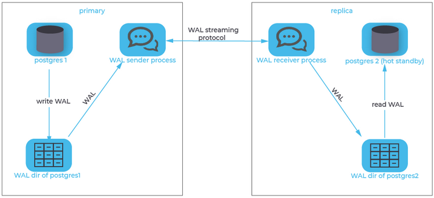

# Binary Replication

Because PostgreSQL uses **a transaction log to enable replay or reversal of transactions** , you could continually copy the contents of the transaction log (located in the **pg_wal**  or pg_xlog directory) as **it is produced by the primary server to the replica** , where you configure the replica to replay any new transaction log files that are copied to it's own pg_wal or pg_xlog directory.

**The biggest disadvantage**  to this method is the fact that transaction log is contained in chunks of usually 16MB. So, if you were to wait for the primary to switch to the next chunk before copying the finished one, your replica would always be 16MB worth of log delayed.

One less obvious disadvantage of this method is the fact that the copying **is usually done by a third-party process** , i.e. PostgreSQL is not aware of this process. Thus, it is impossible to tell the primary to delay the acceptance or rejection of a commit request until the replica has confirmed that it has copied all prior transaction log messages.

While this method is useful for scenarios where the Recovery Point Objective (**RPO, i.e. the time span within which transactions may be lost after recovery** ) or the Recovery Time Objective (**RTO, i.e. the time it takes from failure to successful recovery** ) are quite large, it is not sufficient for some high-availability requirements, which sometimes require an RPO of zero and RTO in the range of a couple seconds only.

 

# Streaming Replication

Another approach that is more sophisticated is called streaming replication.
When using streaming replication, single transaction log messages are reproduced to the replica and synchronicity requirements can be handled on a per-message basis.

Streaming replication needs more setup - usually this involves creating a replication user and initiating the replication stream - but this pays off in terms of the recovery objectives.

When streaming replication is employed with the additional requirement of synchronicity, the replica must confirm that it has received (and written) all prior log messages before the primary can confirm or reject a client's commit request. As a result, after a failure on the primary, the replica can instantly be promoted and business can carry on as usual after all connections have been diverted to the replica.

 
