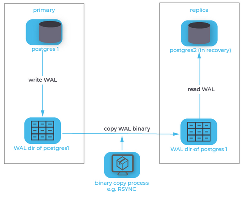

# Binary Replication

Because PostgreSQL uses **a transaction log to enable replay or reversal of transactions** , you could continually copy the contents of the transaction log (located in the **pg_wal**  or pg_xlog directory) as **it is produced by the primary server to the replica** , where you configure the replica to replay any new transaction log files that are copied to it's own pg_wal or pg_xlog directory.

**The biggest disadvantage**  to this method is the fact that transaction log is contained in chunks of usually 16MB. So, if you were to wait for the primary to switch to the next chunk before copying the finished one, your replica would always be 16MB worth of log delayed.

One less obvious disadvantage of this method is the fact that the copying **is usually done by a third-party process** , i.e. PostgreSQL is not aware of this process. Thus, it is impossible to tell the primary to delay the acceptance or rejection of a commit request until the replica has confirmed that it has copied all prior transaction log messages.

While this method is useful for scenarios where the Recovery Point Objective (**RPO, i.e. the time span within which transactions may be lost after recovery** ) or the Recovery Time Objective (**RTO, i.e. the time it takes from failure to successful recovery** ) are quite large, it is not sufficient for some high-availability requirements, which sometimes require an RPO of zero and RTO in the range of a couple seconds only.

 

# Streaming Replication

Another approach that is more sophisticated is called streaming replication.
Streaming replication is part of Write-Ahead Log shipping, where changes to the WALs are immediately made available to standby replicas. With this approach, a standby instance is always up-to-date with changes from the primary node and can assume the role of primary in case of a failover.

When using streaming replication, single transaction log messages are reproduced to the replica and synchronicity requirements can be handled on a per-message basis.

Streaming replication needs more setup - usually this involves creating a replication user and initiating the replication stream - but this pays off in terms of the recovery objectives.

When streaming replication is employed with the additional requirement of synchronicity, the replica must confirm that it has received (and written) all prior log messages before the primary can confirm or reject a client's commit request. As a result, after a failure on the primary, the replica can instantly be promoted and business can carry on as usual after all connections have been diverted to the replica.

 

# Five Reasons Why WAL Segments Accumulate in the pg_wal Directory in PostgreSQL

In PostgreSQL, the pg_wal directory plays a crucial role in managing the Write-Ahead Logging (WAL) mechanism, which ensures the durability of transactions and crash recovery. WAL files are also required for replication purposes (if any).

Eventually, administrators may encounter situations where the pg_wal directory accumulates files, gradually consuming disk space and potentially leading to filesystem issues and database crashes.

The pg_wal directory in PostgreSQL is critical for ensuring data durability and recovery, but its unchecked growth can lead to disk space constraints and operational challenges. By understanding the common reasons behind the accumulation of files in the pg_wal directory and implementing appropriate strategies such as tuning checkpoint settings, monitoring replication lag, and enforcing efficient retention policies, administrators can effectively manage disk space usage and maintain the stability and performance of their PostgreSQL databases.

Since WAL segments play a lead role in PostgreSQL databases, you should never manually remove WAL segments from pg_wal. It might lead to database crashes, failures on crash recoveries, failures on WAL archive events, and incomplete backup copies.


## High transaction rate spikes

**Problem** : High transaction rates or spikes. WAL segments are generated due to PostgreSQL processing transactions before the data files are written. If the transaction rate exceeds the capacity of the system to archive or remove these segments, they accumulate in the pg_wal directory, leading to disk space exhaustion.

Although the archiving speed is generally unimportant, it is expected to keep pace with the average WAL generation rate in the pg_wal directory. If the archiving speed falls significantly behind the WAL segment creation rate for too long, pg_wall will start accumulating files until they are archived. If pg_wal does not have enough space to hold some uncommon/unplanned load, it can run out of space.

## Inefficient checkpointing

**Problem** : Checkpoints in PostgreSQL are crucial for flushing modified data from memory to disk and recycling obsolete WAL segments. However, inefficient checkpointing strategies, such as too-infrequent or too-aggressive checkpoints, can impact the accumulation of WAL files. Infrequent checkpoints result in prolonged retention of WAL segments, while overly aggressive checkpoints may lead to excessive disk I/O and WAL generation.

**Troubleshooting** : Assessing the checkpoint and WAL parametrization regarding the database workload (min_wal_size, max_wal_size, wal_keep_size/wal_keep_segments, bgwriter_lru_maxpages, bgwriter_delay, etc).

**Solution** : Finding a proper trade-off for checkpoint frequency and bgwriter efficiency.

## Replication lag

**Problem** : Delays in applying changes on standby servers can exacerbate the accumulation of WAL files on the primary server. A standby server might fall behind its primary due to network issues/slowness, high load, or HW resource constraints, so the primary server retains WAL segments until they are successfully replayed on the standby. This delay can strain disk space availability on the primary server. 

The above reasons and a misconfiguration in wal_keep_size/wal_keep_segment parameters might contribute to the space exhaustion.

Abandoned replication slots will hold WAL segments indefinitely.

**Troubleshooting** : Verify the replication lag between primary and standbys. Verify the configuration of wall_keep_segments/wal_keep_size (depending on your database version). Looking for abandoned replication slots in the primary server.

**Solution** : Improving the network performance or IO performance on the standby server (or any hardware bottleneck). Dropping any abandoned replication slots. Adjusting the wall_keep_segments/wal_keep_size configuration according to the replication performance and pg_wal directory capacity (in primary).

## Failing WAL archive

**Scope** : This only applies when the database runs in continuous archiving (archive_mode is set to on, and archive_command is also set).

**Problem** : If the archiver process fails to perform the command in archive_command, WAL segments will remain on the pg_wal until the archiver succeeds.

The most common reasons can be related to full disks/filesystem (where archive_command points to), missing paths, wrong privileges, timeouts, unreachable destinations, and wrong archive_command.

**Troubleshooting** : Whenever archive_command fails, you will get an error message in the PostgreSQL log.

## Retention policies

**Problem** : Misconfigured or inadequate retention policies for WAL archives can also contribute to accumulating files in the pg_wal directory. If archival processes fail to remove obsolete WAL segments promptly, the directory may become bloated with unnecessary files, consuming disk space that could be used for other purposes.

**Troubleshooting** : Reviewing the aforementioned min_wal_size, max_wal_size, wal_keep_size/wal_keep_segments parameters. Reviewing PostgreSQL log for failing archive events.

**Solution** : Improving parametrization and fixing failing archive reasons.


# Write-Ahead Logging (WAL)

Write-Ahead Logging (WAL) is a standard method for ensuring data integrity. A detailed description can be found in most (if not all) books about transaction processing. Briefly, WAL's central concept is that changes to data files (where tables and indexes reside) must be written only after those changes have been logged, that is, after WAL records describing the changes have been flushed to permanent storage. If we follow this procedure, we do not need to flush data pages to disk on every transaction commit, because we know that in the event of a crash we will be able to recover the database using the log: any changes that have not been applied to the data pages can be redone from the WAL records. (This is roll-forward recovery, also known as REDO.)

Using WAL results in a significantly reduced number of disk writes, because only the WAL file needs to be flushed to disk to guarantee that a transaction is committed, rather than every data file changed by the transaction. The WAL file is written sequentially, and so the cost of syncing the WAL is much less than the cost of flushing the data pages. This is especially true for servers handling many small transactions touching different parts of the data store. Furthermore, when the server is processing many small concurrent transactions, one fsync of the WAL file may suffice to commit many transactions.

WAL also makes it possible to support on-line backup and point-in-time recovery

**Scenario** 
Although the databases themselves only use around 10GB of disk space, the WAL files (especially the archived WAL files) eat 63GB!

This is because by default the archived WAL files are kept forever if "archive_mode" is set to on in the PostgreSQL config:

```sh
archive_mode = on        # enables archiving; off, on, or always
archive_command = 'cp %p /var/lib/postgresql/9.6/main/archive/%f' 
```

A hot_standby replica server is basically ALWAYS running in recovery; means that the "archive_command" will never run on it. Lesson 1 learned: Cleaning up must be done on the master server. 
