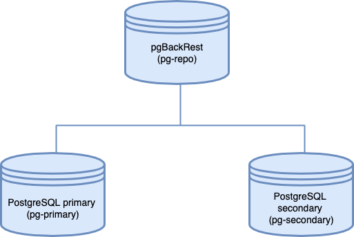

# Architecture 

We will use a three server architecture where pgBackRest resides on a dedicated remote host. The servers communicate with each other via passwordless SSH.

The following diagram illustrates the architecture layout:

 

- Components:

The architecture consists of three server instances:

1. pg-primary hosts the primary PostgreSQL server. Note that “primary” here means the main database instance and does not refer to the primary node of a PostgreSQL replication cluster or a HA setup.

2. pg-repo is the remote backup repository and hosts pgBackRest. It’s important to host the backup repository on a physically separate instance, to be accessed when the target goes down.

3. pg-secondary is the secondary PostgreSQL node. Don’t confuse it with a hot standby. “Secondary” in this context means a PostgreSQL instance that’s idle. We will restore the database backup to this instance when the primary PostgreSQL instance goes down.

__Note: When you are using a high-availability setup, It's recommend configuring pgBackRest to back up the hot standby server so the primary node is not unnecessarily loaded.__


# Deployment

I will use the nodes with the following IP addresses:

| Node name     | Internal IP address |
|---------------|----------------------|
| pg-primary    | 10.104.0.3          |
| pg-repo       | 10.104.0.5          |
| pg-secondary  | 10.104.0.4          |

- Set up hostnames

In our architecture, the pgBackRest repository is located on a remote host. To allow communication among the nodes, passwordless SSH is required. To achieve this, properly setting up hostnames in the /etc/hosts files is very important.

1. Define the hostname for every server in the /etc/hostname file. The following are the examples of how the /etc/hostname file in three nodes looks like:

```bash
cat /etc/hostname
pg-primary

cat /etc/hostname
pg-repo

cat /etc/hostname
pg-secondary
``` 

2. For the nodes to communicate seamlessly across the network, resolve their hostnames to their IP addresses in the /etc/hosts file. (Alternatively, you can make appropriate entries in your internal DNS servers)

The /etc/hosts file for the pg-primary node looks like this:

```
127.0.1.1 pg-primary pg-primary
127.0.0.1 localhost
10.104.0.5 pg-repo
```

The /etc/hosts file in the pg-repo node looks like this:

```
127.0.1.1 pg-repo pg-repo
127.0.0.1 localhost
10.104.0.3 pg-primary
10.104.0.4 pg-secondary
```

The /etc/hosts file in the pg-secondary node is shown below:

```
127.0.1.1 pg-secondary pg-secondary
127.0.0.1 localhost
10.104.0.3 pg-primary
10.104.0.5 pg-repo
```

3. Set up passwordless SSH (for the postgres user)

4. Install Percona Distribution for PostgreSQL

Configure PostgreSQL on the primary node for continuous backup.

At this step, configure the PostgreSQL instance on the pg-primary node for continuous archiving of the WAL files. 

4.1 postgres config

```
archive_command = 'pgbackrest --stanza=prod_backup archive-push %p'
archive_mode = on
listen_addresses = '*'
log_line_prefix = ''
max_wal_senders = 3
wal_level = replica
```

This configuration option informs PostgreSQL to use pgBackRest to handle the WAL
segments, pushing them immediately to the archive.

4.2 restart postgres


5. Install pgBackRest

```
apt-get install percona-pgbackrest
```

Create the pgBackRest configuration file

Run the following commands on all three nodes to set up the required configuration file for pgBackRest.

5.1 Configure a location and permissions for the pgBackRest log rotation:

```
mkdir -p -m 770 /var/log/pgbackrest
chown postgres:postgres /var/log/pgbackrest
```

5.2 Configure the location and permissions for the pgBackRest configuration file:

```
mkdir -p /etc/pgbackrest
mkdir -p /etc/pgbackrest/conf.d
touch /etc/pgbackrest/pgbackrest.conf
chmod 640 /etc/pgbackrest/pgbackrest.conf
chown postgres:postgres /etc/pgbackrest/pgbackrest.conf
mkdir -p /home/pgbackrest
chown postgres:postgres /home/pgbackrest
```

5.3 Update pgBackRest configuration file in the primary node

Configure pgBackRest on the pg-primary node by setting up a stanza. A stanza is a set of configuration parameters that tells pgBackRest where to backup its files. Edit the `/etc/pgbackrest/pgbackrest.conf` file in the pg-primary node to include the following lines:

```
[global]
repo1-host=pg-repo 
repo1-host-user=postgres
process-max=2
log-level-console=info
log-level-file=debug

[prod_backup]
pg1-path=/var/lib/postgresql/14/main
```

You can see the pg1-path attribute for the prod_backup stanza has been set to the PostgreSQL data folder.

5.4 Update pgBackRest configuration file in the remote backup repository node

Add a stanza for the pgBackRest in the pg-repo node. Edit the `/etc/pgbackrest/pgbackrest.conf` configuration file to include the following lines:

```
[global]
repo1-path=/home/pgbackrest/pg_backup
repo1-retention-full=2
process-max=2
log-level-console=info
log-level-file=debug
start-fast=y
stop-auto=y

[prod_backup]
pg1-path=/var/lib/postgresql/14/main
pg1-host=pg-primary
pg1-host-user=postgres
pg1-port = 5432
```

Initialize pgBackRest stanza in the remote backup repository node

After the configuration files are set up, it’s now time to initialize the pgBackRest stanza. Run the following command in the remote backup repository node (pg-repo).

Once the stanza is created successfully, you can try out the different use cases for disaster recovery.

6. Testing Backup and Restore with pgBackRest

This section covers a few use cases where pgBackRest can back up and restore databases either in the same instance or a different node.

Use Case 1: Create a backup with pgBackRest

6.1 To start our testing, let’s create a table in the postgres database in the pg-primary node and add some data.

```
CREATE DATABASE testing
WITH 
   OWNER = postgres
   ENCODING = 'UTF8'
   CONNECTION LIMIT = -1;
```

```
CREATE TABLE CUSTOMER (id integer, name text);
INSERT INTO CUSTOMER VALUES (1,'john');
INSERT INTO CUSTOMER VALUES (2,'martha');
INSERT INTO CUSTOMER VALUES (3,'mary');
```

6.2 Take a full backup of the database instance. Run the following commands from the pg-repo node:

```
$ pgbackrest -u postgres  --stanza=prod_backup backup --type=full
```

If you want an incremental backup, you can omit the type attribute. By default, pgBackRest always takes an incremental backup except the first backup of the cluster which is always a full backup.

If you need a differential backup, use diff for the type field:

```
$ pgbackrest -u postgres --stanza=prod_backup backup --type=diff
```

Use Case 2: Restore a PostgreSQL Instance from a full backup¶

For testing purposes, let’s “damage” the PostgreSQL instance.

1. Run the following command in the pg-primary node to delete the main data directory.

```
$ rm -rf /var/lib/postgresql/14/main/*
```

2. To restore the backup, run the following commands.

- Stop the postgresql instance

```
$ sudo systemctl stop postgresql
```

- Restore the backup:

```
$ pgbackrest -u postgres --stanza=prod_backup restore
```

- Start the postgresql instance

```
$ sudo systemctl start postgresql
```

3. After the command executes successfully, you can access PostgreSQL from the psql command line tool and check if the table and data rows have been restored.

Use Case 3: Point-In-Time Recovery

If your target PostgreSQL instance has an already existing data directory, the full restore option will fail. You will get an error message stating there are existing data files. In this case, you can use the --delta option to restore only the corrupted files.

For example, let’s say one of your developers mistakenly deleted a few rows from a table. You can use pgBackRest to revert your database to a previous point in time to recover the lost rows.

To test this use case, do the following:

1. Take a timestamp when the database is stable and error-free. Run the following command from the psqlprompt.

```
SELECT CURRENT_TIMESTAMP;
       current_timestamp       
-------------------------------
 2021-11-07 11:55:47.952405+00
(1 row)
```

Note down the above timestamp since we will use this time in the restore command. Note that in a real life scenario, finding the correct point in time when the database was error-free may require extensive investigation. It is also important to note that all changes after the selected point will be lost after the roll back.

2. Delete one of the customer records added before.

```
DELETE FROM CUSTOMER WHERE ID=3;
```

3. To recover the data, run a command with the noted timestamp as an argument. Run the commands below to recover the database up to that time.

- Stop the postgresql instance

```
$ sudo systemctl stop postgresql
```

- Restore the backup

```
$ pgbackrest -u postgres --stanza=prod_backup --delta \
--type=time "--target= 2021-11-07 11:55:47.952405+00" \
--target-action=promote restore
```

- Start the postgresql instance

```
$ sudo systemctl start postgresql
```

Check the database table to see if the record has been restored.

```
SELECT * FROM customer;
 id |  name  
----+--------
  1 | john
  2 | martha
  3 | mary
(3 rows)
```

Use Case 4: Restoring to a Separate PostgreSQL Instance

Sometimes a PostgreSQL server may encounter hardware issues and become completely inaccessible. In such cases, we will need to recover the database to a separate instance where pgBackRest is not initially configured. To restore the instance to a separate host, you have to first install both PostgreSQL and pgBackRest in this host.

In our test setup, we already have PostgreSQL and pgBackRest installed in the third node, pg-secondary. Change the pgBackRest configuration file in the pg-secondary node as shown below.

```
[global]
repo1-host=pg-repo
repo1-host-user=postgres
process-max=2
log-level-console=info
log-level-file=debug

[prod_backup]
pg1-path=/var/lib/postgresql/14/main
```

There should be bidirectional passwordless SSH communication between pg-repo and pg-secondary. 

Stop the PostgreSQL instance

```
$ sudo systemctl stop postgresql
```

Restore the database backup from pg-repo to pg-secondary.

```
$ pgbackrest -u postgres --stanza=prod_backup --delta restore

2021-11-07 13:34:08.897 P00   INFO: restore command begin 2.36: --delta --exec-id=109728-d81c7b0b --log-level-console=info --log-level-file=debug --pg1-path=/var/lib/postgresql/14/main --process-max=2 --repo1-host=pg-repo --repo1-host-user=postgres --stanza=prod_backup
2021-11-07 13:34:09.784 P00   INFO: repo1: restore backup set 20211107-111534F_20211107-131807I, recovery will start at 2021-11-07 13:18:07
2021-11-07 13:34:09.786 P00   INFO: remove invalid files/links/paths from '/var/lib/postgresql/14/main'
2021-11-07 13:34:11.803 P00   INFO: write updated /var/lib/postgresql/14/main/postgresql.auto.conf
2021-11-07 13:34:11.819 P00   INFO: restore global/pg_control (performed last to ensure aborted restores cannot be started)
2021-11-07 13:34:11.819 P00   INFO: restore size = 23.2MB, file total = 937
2021-11-07 13:34:11.820 P00   INFO: restore command end: completed successfully (2924ms)
```

After the restore completes successfully, restart PostgreSQL:

```
$ sudo systemctl start postgresql
```

Check the database contents from the local psql shell.

```
SELECT * FROM customer;
 id |  name  
----+--------
  1 | john
  2 | martha
  3 | mary
(3 rows)
```

