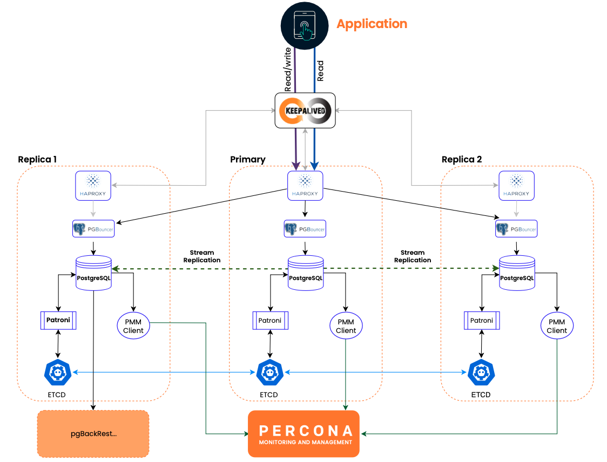

# Overview

 

Components include:

- PostGIS support for geographic objects.
- pg_repack rebuilds PostgreSQL database objects. 
- pgAudit provides detailed session or object audit logging via the standard PostgreSQL logging facility.
- pgAudit set_user – The set_user part of pgAudit extension provides an additional layer of logging and control when unprivileged users must escalate themselves to superuser or object owner roles in order to perform needed maintenance tasks.
- pgBackRest is a backup and restore solution for PostgreSQL.
- Patroni is an HA (High Availability) solution for PostgreSQL.
- pg_stat_monitor collects and aggregates statistics for PostgreSQL and provides histogram information.
- PgBouncer – a lightweight connection pooler for PostgreSQL.
- pgBadger – a fast PostgreSQL Log Analyzer.
- wal2json – a PostgreSQL logical decoding JSON output plugin.
- HAProxy – a high-availability and load-balancing solution.
- etcd– a distributed, reliable key-value store for setting up highly available Patroni clusters
- pgpool-ll – a middleware between PostgreSQL server and client for high availability, connection pooling and load balancing.

