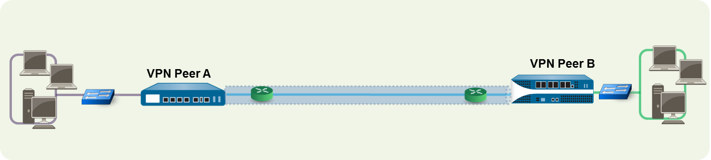

# VPN site-to-site - IPSec

A VPN connection that allows you to connect two local area networks (LANs) is called a site-to-site VPN. 

## Internet Key Exchange version 2 (IKEv2)

The Internet Protocol Security (IPSec) set of protocols is used to set up a secure tunnel for the VPN traffic, and the information in the TCP/IP packet is secured (and encrypted if the tunnel type is ESP). The IP packet (header and payload) is embedded in another IP payload, and a new header is applied and then sent through the IPSec tunnel. The source IP address in the new header is that of the local VPN peer and the destination IP address is that of the VPN peer on the far end of the tunnel. When the packet reaches the remote VPN peer (the firewall at the far end of the tunnel), the outer header is removed and the original packet is sent to its destination.

In order to set up the VPN tunnel, first the peers need to be authenticated. After successful authentication, the peers negotiate the encryption mechanism and algorithms to secure the communication. The Internet Key Exchange (IKE) process is used to authenticate the VPN peers, and IPSec security associations (SAs) are defined at each end of the tunnel to secure the VPN communication. IKE uses digital certificates or pre-shared keys, and the Diffie-Hellman keys to set up the SAs for the IPSec tunnel. The SAs specify all of the parameters that are required for secure transmission— including the security parameter index (SPI), security protocol, cryptographic keys, and the destination IP address—encryption, data authentication, data integrity, and endpoint authentication.

The following figure shows a VPN tunnel between two sites. When a client that is secured by VPN Peer A needs content from a server located at the other site, VPN Peer A initiates a connection request to VPN Peer B. If the security policy permits the connection, VPN Peer A uses the IKE Crypto profile parameters (IKE phase 1) to establish a secure connection and authenticate VPN Peer B. Then, VPN Peer A establishes the VPN tunnel using the IPSec Crypto profile, which defines the IKE phase 2 parameters to allow the secure transfer of data between the two sites.

 
